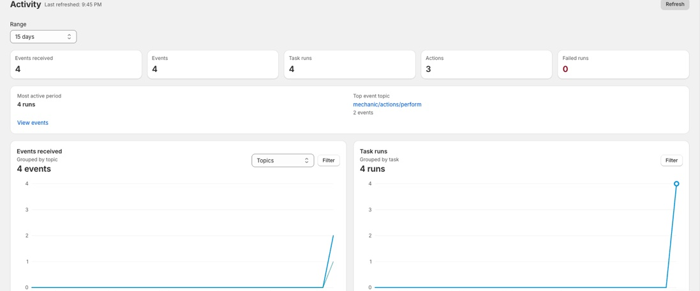

# Activity

The Activity page shows how Mechanic has been processing work for your store over time. Use it to spot busy periods, see which tasks and event topics are active, and find failures that need attention.

<figure><figcaption></figcaption></figure>

## Activity overview

Choose a range — 1 hour, 6 hours, 24 hours, 7 days, or 15 days — to review recent Mechanic activity.

At the top of the page, summary cards show totals for events received, event runs, task runs, action runs, and failed runs. The highlights area calls out the most active period, the top event topic or family, and failures that may need attention.

## Charts and filters

Activity charts show events received, task runs, actions, and success or failure patterns. Events can be grouped by topic or family, while task and action charts are grouped by task and action type.

Use chart filters to focus on specific event topics, tasks, action types, or run outcomes. The chart state is reflected in the page URL, so you can share or return to the same Activity view later.

## Drill into events

Click into an Activity chart to open the [Events](events.md) page with filters preselected for that time window. Use Events when you need the exact event, task run, action run, logs, errors, or event data behind a trend.

Use the task links in Activity when you want to open a task directly from its chart.
