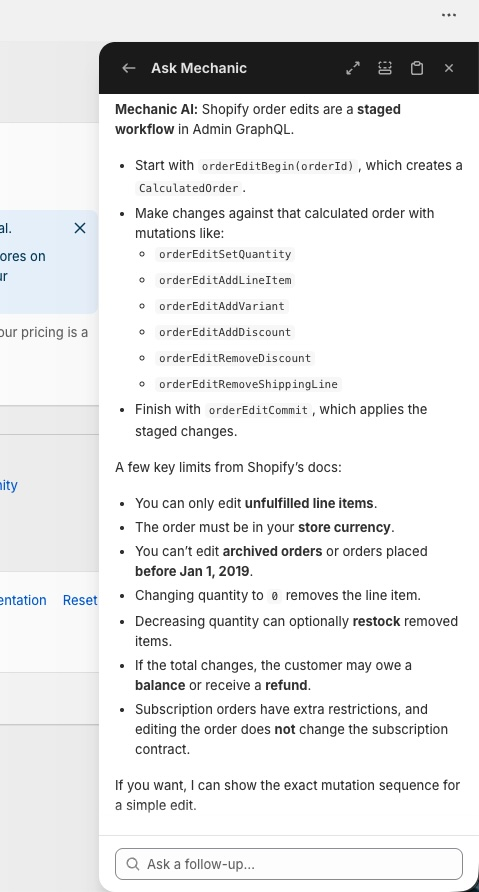
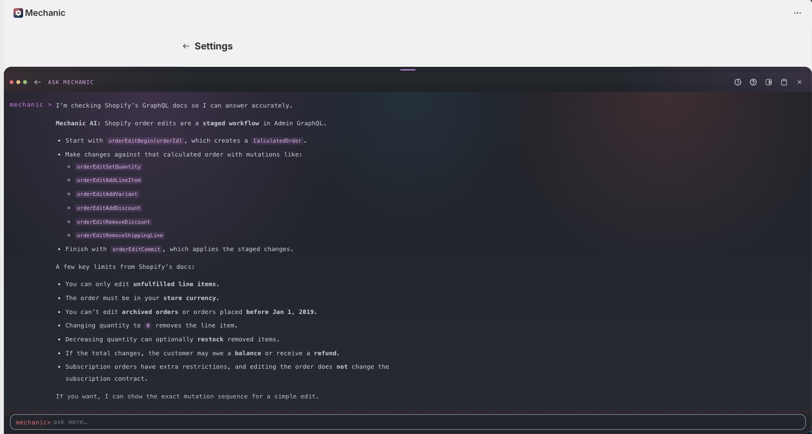

# Ask Mechanic

**Ask Mechanic** is Mechanic's built-in AI assistant. It can answer platform questions, help you find tasks, and explain how features work — all without leaving the app. It has access to Mechanic's full documentation and Shopify's API documentation.

Look for the **Ask Mechanic** button in the Mechanic app to get started, or press `Cmd/Ctrl + J` to toggle it from anywhere (see [Keyboard shortcuts](keyboard-shortcuts.md)). No setup or external tools needed.

<figure><figcaption></figcaption></figure>


Mechanic support covers the platform and tasks from the [task library](../resources/task-library/). Custom tasks (including AI-generated tasks) are not covered by support — for help with custom task logic, ask in the [Mechanic Slack community](../resources/slack.md) or [hire a developer](../hire-a-developer.md).


## What you can ask

* "How do I subscribe to Shopify order creation events?"
* "What action types are available?"
* "How do I respond to action results?"
* "What integrations does Mechanic support?"
* "Find a task that auto-tags orders by discount code"

Ask Mechanic is also available as a dedicated full-screen view:

<figure><figcaption></figcaption></figure>

## For developers

If you're writing tasks in an AI coding tool, check out the full suite of [AI tools for Mechanic](../ai.md) — including the [MCP server](../platform/mcp.md) and [Agent Skills](../platform/agent-skills.md) for deeper integration.
