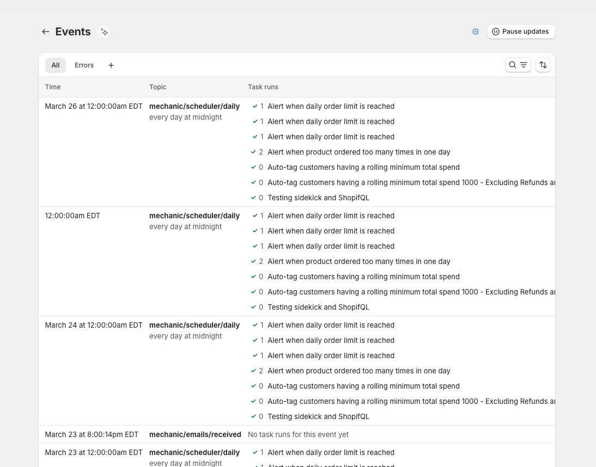
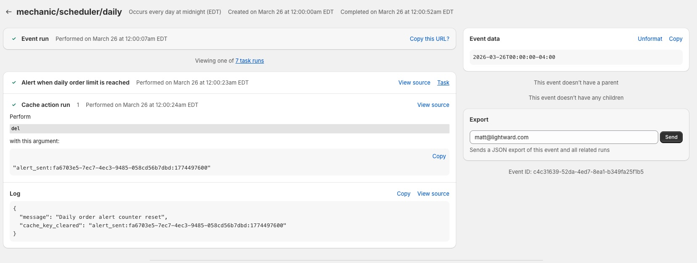

# Events

The Events screen shows a live stream of [events](../core/events/) — the triggers that cause your tasks to run. Use it to monitor your automations, and to investigate when a task isn't behaving as expected.

## Event list

<figure><figcaption></figcaption></figure>

Events are displayed in reverse chronological order, showing the time, topic, and task results for each event. The list updates in real time as new events arrive.

### Filtering

Use the **Filters** button to narrow results by search text, date range, error type, event topic, or specific task. The **Errors** tab provides quick access to all events where something went wrong.

Save filter combinations as **custom views** to quickly return to filtered lists you use often.

## Event detail

<figure><figcaption></figcaption></figure>

Click any event to see exactly what happened: which tasks ran in response, what actions they performed, any errors encountered, and the raw event data (JSON).

If a task failed due to a temporary issue (like a network error), you can **retry** the event to run it again. Use **cancel** to stop a queued event that hasn't started processing yet. You can also **export** the event and all related data as JSON via email — useful for debugging with support or archiving.
