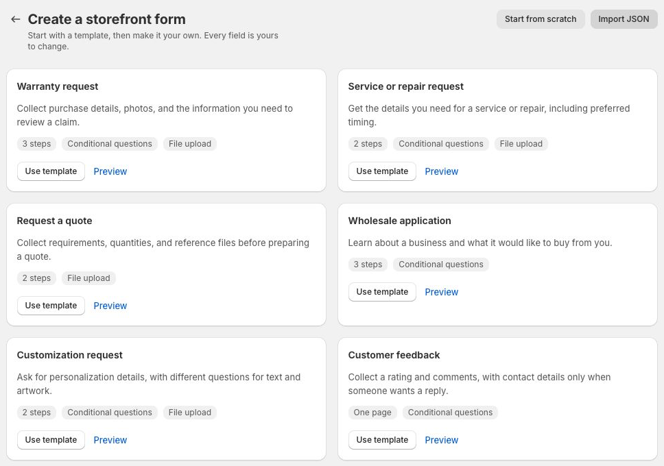
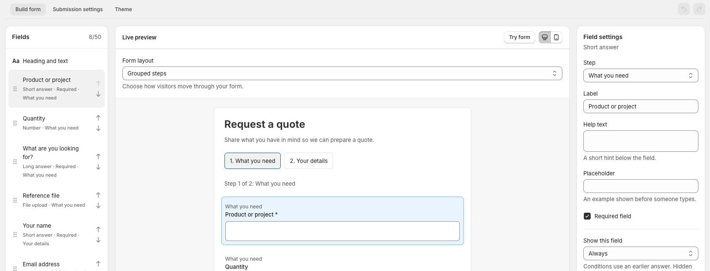
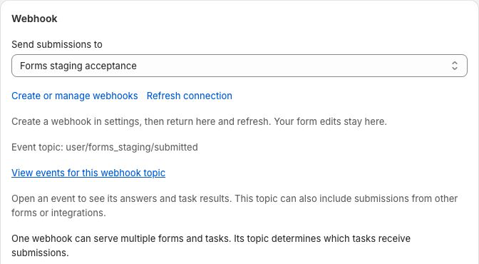
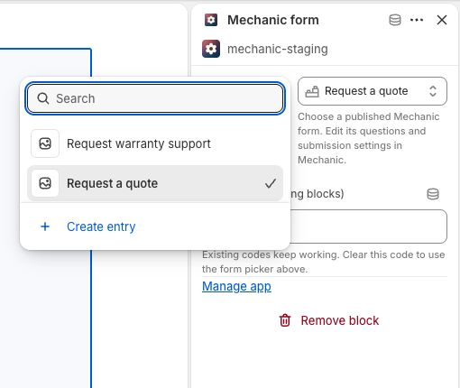
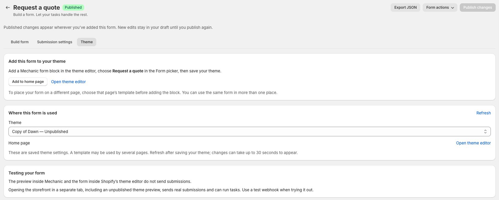

# Storefront forms

Storefront forms connect the people visiting your online store to your Mechanic tasks. Build a form for a quote request, wholesale application, warranty claim, or another workflow, and place it in your theme. When a visitor submits it, your tasks can email your team, save the answers, update Shopify, or connect to another service.

You build the questions visually in Mechanic. Your theme provides the fonts and colors, and the tasks you connect decide what happens with each response. You can start with a template and ready-to-use tasks, or build your own workflow.

The connection uses Mechanic's existing events, tasks, and actions:

**Customer submits a form → webhook creates an event → subscribed tasks run.**

Choose a [Mechanic webhook](../platform/webhooks.md) in the form's Submission settings. The storefront sends answers to its ordinary webhook URL, where Mechanic picks up the queued request and creates an event. Tasks run in the background; the customer sees your confirmation message after the submission is received.


These forms appear in your online store. To collect input from staff using **Run task** inside Mechanic or Shopify admin, see [User Form](../core/tasks/user-form.md).


## Build your form

1. Open **Storefront forms** and choose **Create form**.
2. Choose a starter with **Use template**, **Start from scratch**, or **Import JSON**. A template creates an unpublished draft, ready to edit. **Preview** lets you try its questions and steps without saving or sending your answers.
3. Add fields, then select each field to edit its label and settings. Reorder them with the drag handles or move controls.
4. Set the heading, introduction, and button text. **Form name** is only shown inside Mechanic.
5. Choose **Try form** to try the questions and validation. This preview does not send submissions or run tasks.
6. Save your draft. You can return to it before publishing.

There are seven starters: **Warranty request**, **Service or repair request**, **Request a quote**, **Wholesale application**, **Customization request**, **Customer feedback**, and **Basic form**. Longer starters have two or three steps; some include conditional questions and optional uploads. Every field and message is editable. Choose your own webhook in Submission settings before publishing.

Templates provide questions, not an approval or booking workflow. Your subscribed tasks handle each request. Changes to the starter library do not overwrite forms you have already created.

<figure><figcaption>
Start with the workflow you need, then make the questions your own.
</figcaption></figure>

<figure><figcaption>
Edit questions beside a live preview. This quote-request starter groups its questions into two steps.
</figcaption></figure>

### Choose a layout

Under **Form layout**, choose **Grouped steps** to show the questions in each step together, or **One question at a time** to guide visitors through individual questions. Address fields and multiple-choice options stay together. Both layouts support conditional questions and file uploads.

Use **Try form** to check the flow. Visitors can go Back without losing their answers or selected files. Nothing is submitted until the final Send button. Save and publish to update the layout in your theme; existing forms keep their current layout until you change it. The layout also travels with JSON exports.

Your theme supplies the form’s fonts and colors. You do not need to edit theme code or write storefront JavaScript to use a form block.

## Collect leads and inquiries

Use a form to learn what a potential customer needs, then let your tasks deliver the details to the people and systems that will handle the request. These starters are ready to customize:

| Start with | What you can learn | Connect tasks to |
| --- | --- | --- |
| **Request a quote** | The product or project, quantity, requirements, and needed-by date. | Email your sales team and save each inquiry in a Google Sheet for follow-up. |
| **Wholesale application** | The business, how it sells, products of interest, and estimated order quantity. | Email the team that reviews applications and keep a record in Shopify metaobjects. |
| **Service or repair request** | The service needed, product or item, supporting photos, and preferred date. | Email your service team, including attachments when enabled, and save requests for review. |

Use the [email and storage tasks](#put-submissions-to-work) below, or subscribe your own tasks to the same webhook. The starters collect the information; your team or your configured tasks decide how to qualify and follow up on each inquiry. Start with the [quote-request walkthrough](#example-collect-and-follow-up-on-quote-requests).

## Connect your tasks

Open **Submission settings** and choose a webhook under **Send submissions to**. Its event topic determines which tasks receive the submission. The form does not have a separate event topic.

Choose **Create or manage webhooks** to open webhook settings in a separate tab. [Create the webhook](../resources/tutorials/creating-a-mechanic-webhook.md), return to your form, and choose **Refresh connection** to select it. Your form edits stay in the original tab.

**Tasks subscribed to this topic** lists the connected tasks, with links to open them. Disabled tasks are marked and will not run. If the list is empty, add the webhook’s topic to the subscriptions of a task you want to run. One webhook can serve several forms and tasks. If no enabled tasks subscribe to its topic, submissions can create events, but no tasks will process them. You can still publish while setting up the tasks.

Choose **View events for this webhook topic** to see its events. Open an event to inspect the answers and task results. Other forms or integrations using the same topic can appear in this list too.

Write a **Confirmation message** such as “Thanks! We received your request.” Tasks run in the background, so the message should confirm receipt without promising that a task has already finished.

Writing your own task? See [Storefront form submissions](../platform/webhooks.md#storefront-form-submissions) for answer fields, file uploads, and submission metadata.

<figure><figcaption>
The webhook connects the form to your tasks. Its topic determines which tasks receive submissions.
</figcaption></figure>

## Put submissions to work

After choosing a webhook, you can use these tasks on its event topic:

- [Google Sheets task](https://tasks.mechanic.dev/save-mechanic-form-submissions-to-a-google-sheet): save answers as spreadsheet columns, with an option to upload files to Google Drive and save their links. Files are not automatically shared publicly.
- [Email task](https://tasks.mechanic.dev/email-mechanic-form-submissions): send answers to your team, with an option to include uploaded files as attachments.
- [Shopify metaobjects task](https://tasks.mechanic.dev/save-mechanic-form-submissions-to-shopify-metaobjects): save all answers in a standard Shopify entry, with storefront access off.

Install the tasks you need; they can run together. Copy the webhook's **Event topic** into the task's **Webhook event topic** option. For the simplest setup, give the form its own webhook topic. If several forms share the topic, use the task's optional **Form ID** to handle just one form; leave it blank to handle all Mechanic forms on that topic. Complete the task's destination setup, save and enable it, then return to the form and refresh the connection. The task should appear in the subscribed-task list. Installing a task does not reconnect the form or complete its setup automatically.

To find a saved form's ID, open it in Mechanic and copy the code after `/forms/` in the page address, stopping before any `?`. This is also called the form code; it identifies the form, independently of its editable name.

**Choose what happens to uploaded files.** The Google Sheets task can save them to Google Drive when its upload option is enabled, and the email task can include them as attachments. Without those options, you receive file details only. The metaobject task stores answers and file details, not the files themselves. Files in the original Mechanic event follow its normal retention.

### Example: collect and follow up on quote requests

1. Create a form from **Request a quote**. Adapt the product, quantity, requirements, and date questions to what your team needs to prepare a quote. Keep the name and email fields so your team can respond.
2. In **Submission settings**, choose a webhook. Install the **Email task** linked above and copy that webhook's exact **Event topic** into the task's **Webhook event topic** option. Set **Form ID** to this form's ID if the webhook serves other forms too.
3. Set **Email recipients** to your sales team's addresses, **Email subject** to “New quote request,” and **Reply to email field key** to `email`. When the submission contains a valid email address, staff can reply to the notification to contact the person who submitted it. Enable **Include uploaded files** if the team should receive reference files as attachments. Complete the task's setup, including [Mechanic email approval](../platform/email/README.md), then save and enable it.
4. To keep a shared list, install the **Google Sheets task** on the same webhook topic and set the same **Form ID**. Complete its Google account and spreadsheet setup. In **Column headings and field keys**, map `Name → name`, `Email → email`, `Product or project → product_or_project`, `Quantity → quantity`, `Requirements → requirements`, and `Needed by → needed_by`. These keys match the starter; adjust the mapping if you change them. The email and storage tasks can run together. You can use the **Shopify metaobjects task** instead if you want to keep the answers in Shopify.
5. Return to the form and choose **Refresh connection**. Confirm the tasks are listed and enabled. Use a confirmation such as “Thanks! Your quote request has been submitted.” Publish the form and [add it to your theme](#add-the-form-to-your-theme).
6. Submit a sample from the storefront using test contact details. Choose **View events for this webhook topic**, open the event, and check the email and storage action results. Confirm the notification arrives, its reply address is correct, and the saved record contains the answers. Your team can then review the request and reply with a quote.

The same setup works for wholesale and service inquiries: choose the relevant starter, notification recipients, and storage fields. Extra routing, customer updates, or automated follow-up require tasks configured for those actions. Marketing signup, if wanted, needs its own consent question and task setup.

### Example: a warranty request

1. Create a form from **Warranty request** and select a webhook in Submission settings.
2. Install the **Google Sheets task**. Connect your Google account under Mechanic's Settings → Authentication, then set the account and spreadsheet title in the task. Configure columns using the warranty form's data keys: `Name → name`, `Email → email`, `Product → product`, and `Request → issue`. Keep `receipt` and `photo` out of that mapping; their details appear in the fixed File details column.
3. Save and run the task manually with Spreadsheet ID blank. Copy `spreadsheet_id` from the completed setup action into the task and save again. The sheet must be created through Mechanic. Headers and configured column order must stay aligned.
4. Alternatively, install the **Shopify metaobjects task**, set Form name to Warranty request, grant its requested permissions, and run it manually once. Wait for the definition setup action to succeed. Records will appear in Shopify under **Content → Metaobjects → Mechanic form submission**. Answers are stored as JSON so changing questions does not require a new definition.
5. Enable the task, publish/place the form, and submit a sample from the actual storefront. Check both the task's action result and the saved row or entry. A form confirmation alone does not establish a successful save.

Google Sheets appends may duplicate a row when an event is rerun or a visitor resends. The task includes IDs for finding repeats and disables ambiguous-write retries; inspect the sheet before manually retrying a failed append. The metaobject task updates the same entry when the same Mechanic event is rerun. A new HTTP submission creates a new event and a separate entry, even with the same browser submission ID.

When **Include uploaded files** is off in the email task, the message contains file names and sizes, with no download links. Turn it on to receive the files as attachments, or use the Google Sheets task’s Google Drive upload option for lasting storage. Metaobject submission records store file details, not the uploaded files. Files in the original event follow Mechanic’s normal event retention; Forms does not provide separate file hosting or expiring download links.

## Add the form to your theme

1. Save your draft, then choose **Publish form**. Mechanic opens the **Theme** tab, which you can return to at any time.
2. Choose **Add to home page**, or **Open theme editor** to choose another template.
3. Add or select the **Mechanic form** block. Choose your published form in its **Form** picker and place the block where you want it. The picker uses the published heading visitors see, rather than the internal **Form name**.
4. Click **Save** in the theme editor.
5. Open the storefront page in a separate tab and send a test submission. Check the resulting event and task runs in Mechanic.

The link opens the editor; it does not save the theme or select a form for you. Your theme must support app blocks at the chosen location. The same form can have several placements. Older blocks with a form code keep working. Clear an existing code before switching that block to the picker. Publishing adds the form to the picker in the background. If it is still being added, choose **Check form picker**. If there is an error or a longer delay, **Use a form code instead** reveals instructions for placing it by code.

<figure><figcaption>
Choose the published form in the block's Form setting, then save your theme.
</figcaption></figure>

Placements belong to each theme. If you publish a different theme, add the form block to that theme too; the saved form and connected tasks can stay the same. The form block works independently of the **Online store JavaScript** app embed used by some tasks.

### Where is this form used?

In the **Theme** tab, **Where this form is used** checks saved placements in your live theme. Choose another theme to check its placements, including unpublished themes. Each result identifies the template or section group and links to the theme editor. Hidden blocks are marked. A template may serve several pages; the list does not enumerate individual page URLs.

Saving a form adds permission to read your themes to Mechanic’s required access. If an update is needed, choose **Update access** and approve the Shopify permission request. This lets Mechanic find where your forms are placed without changing theme files. The [Permissions page](settings.md#permissions) lists **Forms** as the reason for this access. Deleting your last form removes this requirement unless a task or another feature still needs it. Your forms continue working while you complete the step. After granting access, return to the form’s Theme tab.

Choose **Refresh** after saving a theme. Results can take up to 30 seconds to update. Unsaved editor changes are not included. Blocks that choose their form through connected data can vary by page and cannot be attributed to one form; Mechanic explains when a check includes those blocks. A failed check is not evidence that the form is unused.

<figure><figcaption>
Choose a theme to see its saved placements. This quote form is on the Home page of an unpublished theme; the link opens that theme in the editor.
</figcaption></figure>

### Test without surprises

The preview inside Mechanic and the form inside Shopify’s theme editor do not send submissions or run tasks. **A storefront opened in a separate tab, including an unpublished theme preview, sends real submissions and can run tasks.** Use a test webhook and test destinations when trying delivery.

## Steps, conditions, and files

Use **Manage steps** to name and arrange up to 10 steps, then use each field’s **Step** setting to place it. Visitors keep their answers and selected files when moving between steps. Only the final submit button sends the form; partial answers are not sent after each step.

Use **Show this field** to ask a question based on an earlier answer. Hidden questions are not required, and their old answers or files are left out of the submission. Empty conditional steps are skipped. If reordering a question leaves a condition needing attention, correct it before saving.

**File upload** accepts one file per field. Choose allowed extensions and a per-file limit from 1 to 3 MB. All files together must fit within **3 MB per submission**. Tasks receive the name, type, size, and base64 contents in the normal webhook file format; no separate file hosting is needed.

Other fields include text, email, phone, website, numbers, dates, time, date and time, addresses, dropdowns, radio choices, single and multiple checkboxes, ratings, and headings. Time values represent the time entered by the visitor and do not include a timezone.

## Duplicate a form

Save or discard any edits, then choose **Form actions → Duplicate form**. The copy starts as an unpublished draft in the same shop. It keeps the saved questions, data keys, steps, conditions, text, and available webhook connection. It does not copy submissions or theme placements. Review its webhook and tasks before publishing; using the same webhook means the same subscribed tasks can process both forms.

## Copy a form to another shop

Choose **Export JSON** to download the current form, including any valid unsaved edits. Fields, data keys, settings, steps, conditions, and text are included. Answers, files, tasks, webhook credentials, and theme placements are not included.

In the destination shop, open **Storefront forms → Import form** and upload or paste the JSON. Review it, select that shop’s webhook or **Choose later**, then choose **Import as draft**. The new form starts unpublished and gets a new form code. It needs a webhook before publishing.

Set up the destination shop’s webhook and subscribed tasks separately. Publish the form and select it in that shop’s theme. Importing does not reconnect the form to the original shop.

## Update or stop a form

Saving edits updates the draft. Visitors keep seeing the published version until you choose **Publish changes**. Published changes apply everywhere that form is placed.

Choose **Form actions → Unpublish form** to stop showing the form to new visitors. It can take up to 30 seconds for the published version to stop loading. Unpublished forms are hidden on the storefront; the theme editor explains why the block is unavailable. Someone with the form already open can still send it, and the reusable webhook stays available. Disabling or deleting the webhook stops it from creating events, but affects every form or integration using that webhook. Previously received events continue through the normal task queue.

**Form actions → Delete form** removes the saved form after confirmation. Its webhook and previously received events remain. Remove any blocks you no longer need from your themes.

Disabling a task stops that task from running; it does not unpublish the form. Other enabled tasks subscribed to the same webhook can still run. Unpublish the form and remove its block from the theme when it is no longer needed.

If a visitor loses the confirmation, their answers stay on screen. **Send again** warns that the earlier submission may have arrived and another attempt could send it twice. The form does not retry automatically. The normal webhook acknowledgment confirms receipt at the webhook service; it does not confirm a task ran, and it also acknowledges disabled or invalid webhook URLs.
