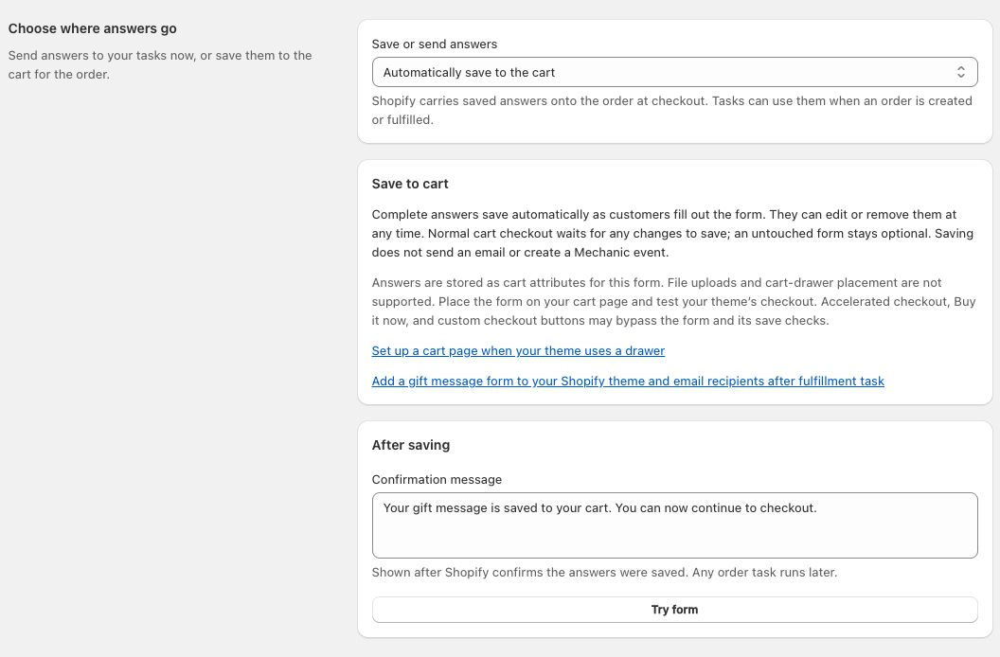
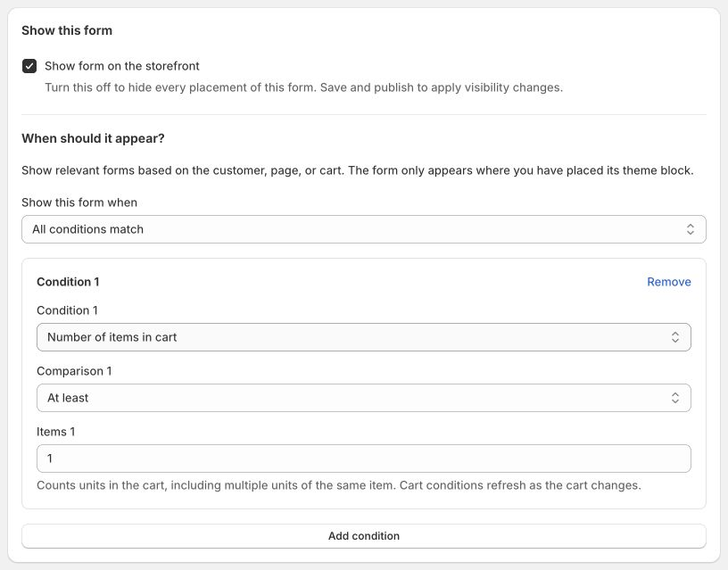
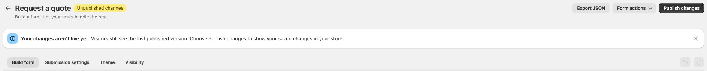

# Storefront forms

Storefront forms connect the people visiting your online store to your Mechanic tasks. Build a form for a quote request, wholesale application, warranty claim, or another workflow, and place it in your theme. When a visitor submits it, your tasks can email your team, save the answers, update Shopify, or connect to another service.

Place the form where it belongs in your theme, then use **Visibility** to choose when it appears there: for a particular customer, page, or cart.

You build the questions visually in Mechanic. Your theme provides the fonts and colors, and the tasks you connect decide what happens with each response. You can start with a template and ready-to-use tasks, or build your own workflow.

With the default **Send to Mechanic tasks** destination, submissions appear as ordinary Mechanic events and follow the [usual event retention policy](../platform/policies/data.md#retention-of-events). Connect an email or storage task if you want a lasting record outside those events.

For these forms, the connection uses Mechanic's existing events, tasks, and actions:

**Customer submits a form → webhook creates an event → subscribed tasks run.**

Choose a [Mechanic webhook](../platform/webhooks.md) in the form's Submission settings. The storefront sends answers to its ordinary webhook URL, where Mechanic picks up the queued request and creates an event. Tasks run in the background; the customer sees your confirmation message after the submission is received.


These forms appear in your online store. To collect input from staff using **Run task** inside Mechanic or Shopify admin, see [User Form](../core/tasks/user-form.md).


You can also [save answers to the cart](#save-answers-to-the-cart), for gift messages and other details that belong with the order. These forms save directly to Shopify; tasks can use the answers after checkout.

## Build your form

1. Open **Forms** in Mechanic’s app menu, below **Activity**, and choose **Create form**.
2. Choose a starter with **Use template**, **Start from scratch**, or **Import JSON**. A template creates an unpublished draft, ready to edit. **Preview** lets you try its questions and steps without saving or sending your answers.
3. Add fields, then select each field to edit its label and settings. Reorder them with the drag handles or move controls.
4. Under **Heading and text**, set the heading, introduction, and **Submit button text**. Choose a **Form name** you can recognize in Mechanic and Shopify’s form picker. Publishing makes this name publicly readable, so keep private information out of it. The heading visitors see can be different.
5. Choose **Try form** to try the questions and validation. This preview does not send submissions or run tasks.
6. Save your draft. You can return to it before publishing.

You can add up to 50 fields. Under a selected field’s **Field data**, its **Field key** identifies the answer for your tasks. Keep this key stable once a task uses it; you can still change the question’s label.

There are nine starters: **Warranty request**, **Service or repair request**, **Request a quote**, **Request a quote from your cart**, **Add a gift message**, **Wholesale application**, **Customization request**, **Customer feedback**, and **Basic form**. Longer starters have two or three steps; some include conditional questions and optional uploads. Every field and message is editable. **Request a quote from your cart** starts with a button that opens the form, includes the current cart with the submission, and stays hidden while the cart is empty. Place it on your cart page and connect the draft-order task described below. Change its conditions in **Visibility** to suit your workflow. Choose your own webhook in Submission settings before publishing a form that sends to tasks. **Add a gift message** saves to the cart instead and does not need a webhook.

Templates provide questions, not an approval or booking workflow. Your subscribed tasks handle each request. Changes to the starter library do not overwrite forms you have already created.

<figure><figcaption>
Start with the workflow you need, then make the questions your own.
</figcaption></figure>

<figure><figcaption>
Edit questions beside a live preview. This cart quote starter groups its questions into two steps. Display controls whether visitors see the full form or a button first.
</figcaption></figure>

### Choose a layout

Under **Form layout**, choose **Grouped steps** to show the questions in each step together, or **One question at a time** to guide visitors through individual questions. Address fields and multiple-choice options stay together. Both layouts support conditional questions. Webhook forms also support file uploads.

Use **Try form** to check the flow. Visitors can go Back without losing their answers or selected files. Webhook forms send answers only when visitors choose the final submit button; cart-saving forms save complete answers automatically. Save and publish to update the layout in your theme; existing forms keep their current layout until you change it. The layout also travels with JSON exports.

Your theme supplies the form’s fonts and colors. You do not need to edit theme code or write storefront JavaScript to use a form block.

### Open the form from a button

In the **Display** section at the top of **Build form**, set **Show on the page** to **Button that opens the form** and choose the **Open form button text**. The form opens in the same place on the page, and the opening button changes to **Hide form**. Visitors can close and reopen it without losing their answers. The **Submit button text** setting under **Heading and text** controls the separate button that sends the completed form. Cart-saving forms save complete answers automatically and have no final Save button. Choose **Full form** to display the questions immediately.

For cart-saving forms, these settings are **Link that opens the form** and **Open form link text**. The opener looks like an understated text link, such as **Add a gift message**, and reveals the questions inline when chosen.

This option works with any form. Visibility conditions apply to both the button and the form, and your theme still supplies the fonts and colors. Save and publish to change the storefront.

## Collect leads and inquiries

Use a form to learn what a potential customer needs, then let your tasks deliver the details to the people and systems that will handle the request. These starters are ready to customize:

| Start with | What you can learn | Connect tasks to |
| --- | --- | --- |
| **Request a quote from your cart** | The products and quantities in the current cart, plus contact details and requirements. | Create a Shopify draft order for your team to review. |
| **Request a quote** | The product or project, quantity, requirements, and needed-by date. | Email your sales team and save each inquiry in a Google Sheet for follow-up. |
| **Wholesale application** | The business, how it sells, products of interest, and estimated order quantity. | Email the team that reviews applications and keep a record in Shopify metaobjects. |
| **Service or repair request** | The service needed, product or item, supporting photos, and preferred date. | Email your service team, including attachments when enabled, and save requests for review. |

Use the [email and storage tasks](#put-submissions-to-work) below, or subscribe your own tasks to the same webhook. The starters collect the information; your team or your configured tasks decide how to qualify and follow up on each inquiry. Start with the [quote-request walkthrough](#example-collect-and-follow-up-on-quote-requests).

## Save answers to the cart

Use this destination for details that should travel with the customer's order, such as a gift recipient and personal message.

**Customer fills out a form → answers save automatically to the Shopify cart → checkout → order → tasks respond to an order event.**

1. Open **Submission settings** and set **Save or send answers** to **Automatically save to the cart**. No webhook is needed. This replaces the webhook destination; a single save does not also send a webhook.
2. Write a confirmation that describes the save, not a completed task. Cart forms save automatically and do not have a final Save button. Next and Back still guide customers through forms with multiple steps.
3. Save and publish the form, then add its block to the cart page from the **Theme** tab. Save the theme. As with other forms, use a section that supports app blocks.
4. Customers fill in the form and their complete answers save automatically. They can reopen it to edit the details or choose **Remove answers** to clear them from the cart. Normal cart checkout waits for the latest save; incomplete details or a failed save keep the customer on the cart page to fix, retry, or remove those answers. An untouched form stays optional.

<figure><figcaption>
Save with the cart now, then use an order event to run your tasks later.
</figcaption></figure>

Saving succeeds only after Shopify confirms the answers. It does not create a Mechanic event or send email. The cart must contain an item. A failed save keeps the answers available for retry. If saved answers cannot be loaded, the form asks the customer to retry before editing.

**Checkout routes that bypass the form also bypass these questions.** This includes Buy it now and cart drawers without the form. Accelerated payment buttons and custom theme checkout behavior may also bypass the save checks. These checks are a convenience on the cart page, not a checkout validation rule. Make the form easy to find and test the normal checkout button in your theme.

Answers are stored as cart attributes named `mechanic_form_<form ID>_<field key>` and become order custom attributes at checkout. The form changes only its own attributes, leaving the cart note and other apps' attributes alone. Conditional answers that are no longer visible are removed on the next save. Addresses and multiple selections are stored as JSON text. Saved answers are limited to 32 KiB per update, including attribute names; file uploads are not supported.

Cart attributes are customer-editable storefront data, not secrets, verified identity, or access controls. Tasks must validate them. **Emptying a cart does not clear its saved answers.** They stay with that cart until removed or replaced; customers can review them by reopening the form. Unpublishing or deleting a form does not erase answers already saved to carts or orders.

### Cart drawers

Place cart-saving forms on the full cart page. Adding a form there does not add it to a cart drawer. A customer who goes directly from a drawer to checkout may never see the form.

In Dawn, the theme editor's **Theme settings → Cart → Cart type** setting includes a **Page** option. Use that for a cart-page experience. Other themes may offer a similar setting; check with your theme developer.

If you keep a drawer, ask your theme developer to add a clear **Add a gift message** link to the cart page. This link is a theme customization, not something Mechanic inserts automatically. Test the full journey from adding an item to finding the form and checking out on both desktop and mobile. The form remains optional; direct checkout is still possible.

### Example: email a gift message after fulfillment

Follow the illustrated tutorial: [Add a gift message form to your Shopify theme and email recipients after fulfillment](../resources/tutorials/add-a-gift-message-form-to-your-shopify-theme.md).

Start with **Add a gift message**. It collects the sender's name, recipient's name and email, and a personal note. Its optional **Add a gift message** link opens the form inline on the cart page, and its visibility condition requires at least one item in the cart. Shoppers who leave it untouched can check out normally without adding a gift message.

Publish and place the form, then install [Add a gift message form to your Shopify theme and email recipients after fulfillment](https://tasks.mechanic.dev/add-a-gift-message-form-to-your-shopify-theme-and-email-recipients-after-fulfillment). Choose that published form in the task's **Form** option, customize the email, and enable the task. Keep the starter's field data keys or update the task's field key options. Mechanic must be approved to send email, and the task requests order access through the usual permissions flow.

This starter uses **one recipient and one message for the whole order**. It waits until Shopify marks the whole order fulfilled; split shipments wait for their final fulfillment. Saving the gift form does not trigger that email. The task checks the order's current status and records a send claim on the order before queuing the email, to prevent repeated fulfillment events from sending it again. See the task's recovery instructions if an action fails or its outcome is uncertain.

Test the complete path using an inbox you control: save a message, complete a test checkout, confirm the answers on the order, fulfill only part of it (no email), then fulfill the rest and check the email action and inbox. The email omits prices, billing details, and links to the buyer's order status page.

## Connect your tasks

Open **Submission settings**, leave **Save or send answers** set to **Send to Mechanic tasks**, and choose a webhook under **Send submissions to**. Its event topic determines which tasks receive the submission. The form does not have a separate event topic.

Choose **Create or manage webhooks** to open webhook settings in a separate tab. [Create the webhook](../resources/tutorials/creating-a-mechanic-webhook.md), return to your form, and choose **Refresh connection** to select it. Your form edits stay in the original tab.

**Tasks subscribed to this topic** lists the connected tasks, with links to open them. Disabled tasks are marked and will not run. If the list is empty, add the webhook’s topic to the subscriptions of a task you want to run. One webhook can serve several forms and tasks. If no enabled tasks subscribe to its topic, submissions can create events, but no tasks will process them. You can still publish while setting up the tasks.

Choose **View events for this webhook topic** to see its events. Open an event to inspect the answers and task results. Other forms or integrations using the same topic can appear in this list too.

Write a **Confirmation message** such as “Thanks! We received your request.” Tasks run in the background, so the message should confirm receipt without promising that a task has already finished.

Writing your own task? See [Storefront form submissions](../platform/webhooks.md#storefront-form-submissions) for answer fields, file uploads, and submission metadata.

<figure><figcaption>
Choose the webhook your tasks subscribe to. Copy the Form ID only when a custom task needs it; the ready-to-use tasks offer a Form dropdown.
</figcaption></figure>

## Put submissions to work

After choosing a webhook, you can use these tasks on its event topic. Saving or publishing a form does not install these tasks automatically:

- [Create a draft order from a storefront form](https://tasks.mechanic.dev/create-a-draft-order-from-a-storefront-form): turn a cart quote request into a Shopify draft order for review. Requires cart contents to be enabled on the form.
- [Google Sheets task](https://tasks.mechanic.dev/save-mechanic-form-submissions-to-a-google-sheet): save answers as spreadsheet columns, with an option to upload files to Google Drive and save their links. Files are not automatically shared publicly.
- [Email task](https://tasks.mechanic.dev/email-mechanic-form-submissions): send answers to your team, with an option to include uploaded files as attachments.
- [Shopify metaobjects task](https://tasks.mechanic.dev/save-mechanic-form-submissions-to-shopify-metaobjects): save all answers in a standard Shopify entry, with storefront access off.

Install the tasks you need; they can run together. Copy the webhook's **Event topic** into the task's **Webhook event topic** option (called **Mechanic webhook event topic** in the cart draft-order task). For the simplest setup, give the form its own webhook topic. For the email and storage tasks, the **Form** dropdown is optional: choose a published form to handle only its submissions, or leave it blank to handle all Mechanic forms on that topic. The cart draft-order task requires a selected **Form**. Complete the task's destination setup, save and enable it, then return to the form and refresh the connection. The task should appear in the subscribed-task list. Installing a task does not reconnect the form or complete its setup automatically.

For custom task filters, open the saved form's **Submission settings** and choose **Copy form ID**. The ID identifies the form independently of its editable name. Task authors can use the [`storefrontform` option flag](../core/tasks/options/README.md#31-inputtype-flags) to offer the same dropdown. Selecting a form does not change a task's event subscriptions; configure its webhook topic separately.

### Save or receive uploaded files

Choose where the actual files should go when configuring your tasks:

| Task | Answers | Uploaded files |
| --- | --- | --- |
| Email | Sent to the team recipients you configure. | Enable **Include uploaded files** for attachments. Otherwise, the email has file names and sizes, without download links. |
| Google Sheets and Drive | Saved as spreadsheet rows. | Enable **Save uploaded files to Google Drive** to save files and their links. Files are not automatically shared publicly. |
| Shopify metaobjects | Saved in Shopify, with storefront access off. | File details only; the uploaded files are not stored in the metaobject. |

Both file options are off by default. Email attachments do not require a Google connection. Drive uploads use the shop’s connected Google account. Files in the original event follow [Mechanic’s event retention policy](../platform/policies/data.md#retention-of-events); Forms does not provide separate file hosting or expiring download links.

### Example: collect and follow up on quote requests

1. Create a form from **Request a quote**. Adapt the product, quantity, requirements, and date questions to what your team needs. Keep the name and email fields so your team can respond.
2. In **Submission settings**, choose a webhook, such as **Quote requests** with the topic `user/quotes/submitted`. Write a confirmation such as “Thanks! We received your quote request.” Save and publish the form so it becomes available in task dropdowns. You can finish setting up tasks before placing it in your theme.
3. Install the **Email task** linked above. Copy the webhook’s exact topic into **Webhook event topic**, then select your published form in **Form**. This filters the task to this form even if other forms use the same topic.
4. Set **Email recipients** to your sales team’s addresses, **Email subject** to “New quote request,” and **Reply to email field key** to `email`. A valid submitted email address becomes the notification’s reply address. Enable **Include uploaded files** if the team should receive reference files as attachments. Complete [Mechanic email approval](../platform/email/README.md), then save and enable the task.
5. To keep a shared list, install the **Google Sheets task** on the same topic and select the same **Form**. Complete its Google account and spreadsheet setup. In **Column headings and field keys**, map `Name → name`, `Email → email`, `Product or project → product_or_project`, `Quantity → quantity`, `Requirements → requirements`, and `Needed by → needed_by`. These keys match the starter; adjust them if you change the field data keys. The email and storage tasks can run together.
6. Return to the form’s **Submission settings** and choose **Refresh connection**. Confirm your tasks are listed and enabled. Open **Theme** and [add the form to your theme](#add-the-form-to-your-theme).
7. Submit a sample from the storefront using test contact details. Choose **View events for this webhook topic**, open the event, and check the email and storage action results. Confirm that the notification arrives, its reply address is correct, and the saved record contains the answers. Your team can then review the request and reply with a quote.

The same setup works for wholesale and service inquiries: choose the relevant starter, notification recipients, and storage fields. Extra routing, customer updates, or automated follow-up require tasks configured for those actions. Marketing signup, if wanted, needs its own consent question and task setup.

### Example: a warranty request

1. Create a form from **Warranty request** and select a webhook in **Submission settings**. Save and publish it so you can select it in the tasks below; add it to your theme after the tasks are ready.
2. Install the **Google Sheets task**. Set **Webhook event topic** to the chosen webhook’s exact topic and select the warranty form in **Form**. Connect your Google account under Mechanic's Settings → Authentication, then set the account and spreadsheet title in the task. Configure columns using the warranty form's data keys: `Name → name`, `Email → email`, `Product → product`, and `Request → issue`. Upload details appear in the fixed **File details and links** column. With **Save uploaded files to Google Drive** enabled, you can also map `Receipt → receipt` and `Photo → photo` to put the saved files' Drive links in their own columns.
3. Save and run the task manually with Spreadsheet ID blank. Copy `spreadsheet_id` from the completed setup action into the task and save again. The sheet must be created through Mechanic. Headers and configured column order must stay aligned.
4. Alternatively, install the **Shopify metaobjects task**. Set **Webhook event topic** to the same topic, choose the warranty form in **Form**, and set **Form name** to Warranty request. Grant its requested permissions and run it manually once. Wait for the definition setup action to succeed. Records will appear in Shopify under **Content → Metaobjects → Mechanic form submission**. Answers are stored as JSON so changing questions does not require a new definition.
5. Enable the task, add the form to your theme, and submit a sample from the actual storefront. Check both the task's action result and the saved row or entry. A form confirmation alone does not establish a successful save.

Google Sheets appends may duplicate a row when an event is rerun or a visitor resends. The task includes IDs for finding repeats and disables ambiguous-write retries; inspect the sheet before manually retrying a failed append. The metaobject task updates the same entry when the same Mechanic event is rerun. A new HTTP submission creates a new event and a separate entry, even with the same browser submission ID.

### Example: request a quote from the cart

1. Create a form from **Request a quote from your cart**. Keep its contact email field. In **Submission settings**, **Include the cart with each submission** is already selected.
2. Create and select a webhook for quote requests, then save and publish the form.
3. Install [Create a draft order from a storefront form](https://tasks.mechanic.dev/create-a-draft-order-from-a-storefront-form). Set **Mechanic webhook event topic** to the webhook’s topic, choose the published form in **Form**, and leave **Email field key** as `email` unless you changed that field’s key. Save and enable the task, completing Mechanic’s normal permission update if requested.
4. In the form’s **Theme** tab, choose **Add to cart page**. Select the form in its block, position the Apps section near the cart summary, and save the theme. The cart page must support app blocks or an Apps section. This does not add the form to a cart drawer; that needs separate theme customization.
5. Add a product to the cart, open the form, and submit a test request. Inspect the Mechanic event, the task’s Shopify action, and the resulting draft order. Test as both a guest and a signed-in customer.

The form includes products, variants, quantities, and line item properties from the cart when submitted. Shopify supplies current variant prices when the task creates the draft. Cart discounts, shipping rates, and displayed checkout totals are not copied. The task supports up to 100 ordinary variant lines; subscription and bundle items stop for separate review.

Shopify supplies signed customer context automatically. The task verifies it before linking a signed-in customer’s account; a guest’s entered email is contact information, not proof of an account. There is no signing key to enter in form settings.

The customer’s confirmation means the request was received. Creating the draft happens in the background; this task does not send an invoice or clear the cart. Your team reviews the draft before proceeding. Add the email or Google Sheets/Drive task on the same topic if you want uploaded files: draft notes contain file details, not the files themselves.

This is a separate task from [Create a draft order from the cart](https://tasks.mechanic.dev/create-a-draft-order-from-the-cart), which remains available for existing custom-button integrations. New form setups use the task above and require no custom button code or shared secret.

## Add the form to your theme

1. Save your draft, then choose **Publish form**. Mechanic opens the **Theme** tab, which you can return to at any time.
2. Choose **Add to home page**, or **Open theme editor** to choose another template.
3. Add or select the **Mechanic form** block. Choose your published form in its **Form** picker and place the block where you want it. The picker shows the published **Form name**. A short ID appears only when published forms have the same name. Publishing makes that name publicly readable; keep private information out of it. The heading displayed inside the form can be different.
4. Click **Save** in the theme editor.
5. Open the storefront page in a separate tab and send a test submission. Check the resulting event and task runs in Mechanic.

The link opens the editor; it does not save the theme or select a form for you. To switch an existing block to another form, open its **Form** setting and choose **Replace**. Create and edit forms in Mechanic; the theme picker selects a form you have already published.

Your theme must support app blocks at the chosen location. The same form can have several placements. Publishing adds the form to the picker in the background. If it is still being added, choose **Check form picker**. If the picker remains unavailable, contact Mechanic support.

<figure><figcaption>
Choose the published form in the block's Form setting, then save your theme.
</figcaption></figure>

Placements belong to each theme. If you publish a different theme, add the form block to that theme too; the saved form and connected tasks can stay the same. The form block works independently of the **Online store JavaScript** app embed used by some tasks.

### Where is this form used?

In the **Theme** tab, **Where this form is used** checks saved placements in your live theme. Choose another theme to check its placements, including unpublished themes. Each result identifies the template or section group and links to the theme editor. Hidden blocks are marked. A template may serve several pages; the list does not enumerate individual page URLs.

Saving a form adds permission to read your themes to Mechanic’s required access. If an update is needed, choose **Update access** and approve the Shopify permission request. This lets Mechanic find where your forms are placed without changing theme files. The [Permissions page](settings.md#permissions) lists **Forms** as the reason for this access. Deleting your last form removes this requirement unless a task or another feature still needs it. Your forms continue working while you complete the step. After granting access, return to the form’s Theme tab.

Choose **Refresh** after saving a theme. Results can take up to 30 seconds to update. Unsaved editor changes are not included. Blocks that choose their form through connected data can vary by page and cannot be attributed to one form; Mechanic explains when a check includes those blocks. A failed check is not evidence that the form is unused.

<figure><figcaption>
Choose a theme to see its saved placements. This example shows a quote form on the Home page of the live Dawn theme; the link opens that theme in the editor.
</figcaption></figure>

## Choose when a form appears

Placement decides **where** a form can appear. Visibility decides **when** it appears there. For example, place a cart quote form on the cart page and show it only when the cart contains items. A visibility condition alone does not move a form into the cart or include cart contents; placement and **Include the cart with each submission** control those separately.

1. Open the form’s **Visibility** tab.
2. Leave **Show form on the storefront** selected. With no conditions, everyone can see the form wherever you have placed its block. Turning this off hides every placement after you save and publish.
3. Choose **Add condition**, then select what to check and its comparison. Add up to 10 conditions; choose **All conditions match** or **Any condition matches** when combining them.
4. Save the draft, then **Publish changes**. As with questions and text, saving alone does not change the storefront.
5. Once the form picker has synchronized, open a fresh storefront page to test both a matching and a nonmatching case. Reload already-open pages after publishing a new policy.

<figure><figcaption>
The cart quote starter stays hidden while the cart is empty. Change the threshold, then save and publish to apply it wherever the form is placed.
</figcaption></figure>

### Available conditions

| Condition | What it checks |
| --- | --- |
| **Customer sign-in status** | Whether the visitor is signed in or signed out. |
| **Customer tag** | Whether a signed-in customer has, or does not have, a tag. Tag comparisons ignore capitalization and surrounding spaces. Signed-out visitors match neither comparison. |
| **Page type** | Home, product, collection, collection list, page, cart, search, blog, or article. |
| **Product being viewed** | A selected product. Both **Is** and **Is not** apply only on product pages. |
| **Collection being viewed** | A selected collection. Both comparisons apply only on collection pages. |
| **Product in cart** | Whether the cart contains any variant of a selected product. |
| **Variant in cart** | Whether the cart contains the selected variant specifically. |
| **Number of items in cart** | At least, or fewer than, a number of items. This counts units, not distinct products or cart lines. **Fewer than 1** means an empty cart. |

Choose products, variants, and collections from Shopify’s picker. These conditions require product read access through Mechanic’s [normal permissions flow](../core/tasks/permissions.md#permissions-for-other-mechanic-features). Both saved draft rules and published rules count toward that requirement. Customer sign-in and tag conditions do not request extra customer API access.

Shopify checks customer tags while rendering the theme; the customer’s tag list is not sent to Mechanic or included in the form block. The rule values you configure are publicly readable theme data, so do not put secrets in them.

### Examples

- **Cart quote:** start with **Request a quote from your cart**, which appears when **Number of items in cart** is **At least 1**. Place it on the cart page. For bulk inquiries only, increase the threshold, for example to 12.
- **Product-specific service:** show a service request on a selected product’s page using **Product being viewed**.
- **Wholesale inquiries:** show a form to signed-in customers whose **Customer tag** is `wholesale`. A tag condition already excludes signed-out visitors.

Cart conditions update within a few seconds while the page is open. If a cart change hides the form, entered answers stay available when it appears again. A cart drawer can affect those conditions, but placing the form inside the drawer depends on your theme’s support for app blocks there.

The builder preview and Shopify theme editor keep the form visible so you can edit and place it. Test visibility on a storefront page opened in a separate tab, with signed-in and signed-out sessions where relevant. That page can send real submissions, including when previewing an unpublished theme.


Visibility controls display, not authorization. For webhook forms, the webhook remains public, and someone can send it a request without using the visible form. Cart-saving forms use editable cart attributes. Tasks must validate submissions before granting benefits or changing orders. See [Storefront form submissions](../platform/webhooks.md#storefront-form-submissions).


### Test without surprises

| Where you try the form | Does it save or send answers? |
| --- | --- |
| **Try form** or a template **Preview** inside Mechanic | No. Use it to check questions, conditions, and validation. |
| Inside Shopify’s theme editor | No. Use it to check the form’s placement and appearance. |
| A storefront page opened in a separate tab, including an unpublished theme preview | **Yes.** It uses the selected webhook and can run tasks, or saves to the real cart if that destination is selected. |

Use a test webhook and test destinations when checking delivery. For cart-saving forms, use a test cart and order; a saved confirmation does not mean a later order task has run. After submitting, inspect the event and its task/action results as well as the destination. A confirmation message alone does not prove that an email was delivered or a record was saved.

## Steps, conditions, and files

Use **Manage steps** to name and arrange up to 10 steps, then use each field’s **Step** setting to place it. Visitors keep their answers and selected files when moving between steps. For webhook forms, only the final submit button sends the form; partial answers are not sent after each step. Cart-saving forms save when all required details across the steps are complete.

Use **Show this field** to ask a question based on an earlier answer. Hidden questions are not required, and their old answers or files are left out of the submission. Empty conditional steps are skipped. If reordering a question leaves a condition needing attention, correct it before saving.

**File upload** is available for webhook forms and accepts one file per field. Choose allowed extensions and a per-file limit from 1 to 3 MB. All files together must fit within **3 MB per submission**. Tasks receive uploads in the normal webhook file format. Choose an [email or storage task](#save-or-receive-uploaded-files) if you want to keep the files outside the event.

Other fields include text, email, phone, website, numbers, dates, time, date and time, addresses, dropdowns, radio choices, single and multiple checkboxes, ratings, and headings. Time values represent the time entered by the visitor and do not include a timezone.

## Duplicate a form

Save or discard any edits, then choose **Form actions → Duplicate form**. The copy starts as an unpublished draft in the same shop. It keeps the saved questions, data keys, steps, field conditions, visibility rules, button presentation, cart setting, text, and available webhook connection. Product, variant, and collection selections stay connected to this shop. It does not copy submissions or theme placements. The copy gets a new form ID, so it has separate cart attributes when using the cart destination. Select the copy in any order task that should read those answers. Review its webhook and tasks before publishing; using the same webhook means the same subscribed tasks can process both forms.

## Copy a form to another shop

Choose **Export JSON** to download the current form, including any valid unsaved edits. Fields, data keys, settings, steps, field conditions, visibility rules, button presentation, cart setting, and text are included. Answers, files, tasks, webhook credentials, and theme placements are not included.

In the destination shop, open **Forms → Import form** and upload or paste the JSON. Review it, select that shop’s webhook or **Choose later**, then choose **Import as draft**. The new form starts unpublished and gets a new form ID. Webhook forms need a webhook before publishing. Cart-saving forms keep that destination and do not ask for a webhook.

Imported visibility rules keep their conditions and readable resource names, but clear product, variant, and collection selections. Reselect those resources from the destination shop before publishing. This also applies when importing back into the same shop; use **Duplicate form** for a same-shop copy that keeps its selections.

Set up the destination shop’s tasks separately. For cart-saving forms, select the newly published form in the order task; existing saved cart answers do not move with the form. For webhook forms, choose the destination shop’s webhook and subscribe the tasks to its topic. Publish the form and select it in that shop’s theme. Importing does not reconnect the form to the original shop.

## Update or stop a form

Saving edits updates the draft. Visitors keep seeing the published version until you choose **Publish changes**. Published changes apply everywhere that form is placed, including its visibility rules. Reload storefront pages after publishing changes to visibility.

When a published form has saved edits, the form list and editor show an amber **Unpublished changes** badge. The editor also shows **Your changes aren’t live yet**, reminding you that visitors still see the last published version. Choose **Publish changes** to make the saved edits live. If you have made more edits since saving, save those first. You can dismiss the reminder while continuing to work; the **Unpublished changes** badge stays visible. The reminder returns after another successful save or when you reopen the editor. After publishing succeeds, the notice disappears and the status returns to **Published**.

<figure><figcaption>
Saving preserves your draft. Publish changes makes those edits visible to visitors.
</figcaption></figure>

Choose **Form actions → Unpublish form** to stop showing the form to new visitors. It can take up to 30 seconds for the published version to stop loading. Unpublished forms are hidden on the storefront; the theme editor explains why the block is unavailable. Someone with the form already open may still use it. For cart forms, previously saved answers and connected order tasks remain; disable the task separately to stop processing those answers. For webhook forms, the reusable webhook stays available. Disabling or deleting the webhook stops it from creating events, but affects every form or integration using that webhook. Previously received events continue through the normal task queue.

**Form actions → Delete form** removes the saved form after confirmation. Its webhook, previously received events, and any answers already saved to carts or orders remain. Remove any blocks you no longer need from your themes.

Disabling a task stops that task from running; it does not unpublish the form. Other enabled tasks subscribed to the same webhook can still run. Unpublish the form and remove its block from the theme when it is no longer needed.

For webhook forms, if a visitor loses the confirmation, their answers stay on screen. **Send again** warns that the earlier submission may have arrived and another attempt could send it twice. The form does not retry automatically. The normal webhook acknowledgment confirms receipt at the webhook service; it does not confirm a task ran, and it also acknowledges disabled or invalid webhook URLs.
