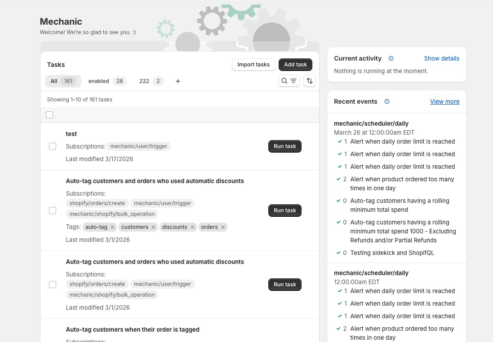

# Home

The Mechanic home screen is your dashboard. It shows your installed tasks, current processing activity, and a live feed of recent events.

<figure><figcaption></figcaption></figure>

## Tasks

The main area of the home screen lists all the tasks installed on your store. Each task shows its name, subscriptions, tags, and last modified date. Click any task to open it in the [task editor](task-editor.md).

Use the **Add task** button to create a new blank task, browse the task library, or import tasks from JSON.

### Filtering and search

Search across task names, code, and options, or filter by enabled status, event topic, Shopify API version, or tags. Save filter combinations as **custom views** for quick access.

### Bulk actions

Select multiple tasks to add or remove tags in bulk, or export tasks as JSON.

## Current activity

The right sidebar shows real-time processing status for your Mechanic queue — how many runs are in progress, how many are waiting, and whether the queue is on schedule or behind. Expand **Show details** for a full breakdown.

## Recent events

A live feed of the most recent [events](events.md). Click **View more** to go to the full [Events](events.md) page.
