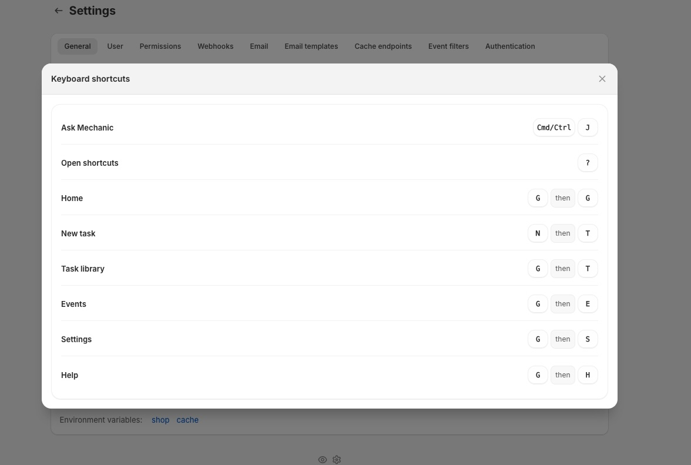

# Keyboard shortcuts

Mechanic includes app-wide keyboard shortcuts for quick navigation, creating tasks, and toggling features like [Ask Mechanic](ask-mechanic.md). Press `?` anywhere in the app to open the shortcuts sheet.


Shortcuts are optional — everything is accessible through the regular UI. They're disabled when you're typing in an input field, textarea, or the code editor, so they won't interfere with your work. The one exception is `Cmd/Ctrl + J`, which toggles Ask Mechanic from anywhere, including the code editor.


<figure><figcaption></figcaption></figure>

## Available shortcuts

### Help

| Shortcut | Action |
| --- | --- |
| `Cmd/Ctrl + J` | Toggle [Ask Mechanic](ask-mechanic.md) |
| `?` | Open keyboard shortcuts sheet |

### Navigation

| Shortcut | Action |
| --- | --- |
| `G` then `G` | Go to [Home](home.md) |
| `G` then `T` | Go to [Task library](../resources/task-library/) |
| `G` then `E` | Go to [Events](events.md) |
| `G` then `S` | Go to [Settings](settings.md) |
| `G` then `H` | Go to Help |

### Create

| Shortcut | Action |
| --- | --- |
| `N` then `T` | Create a new blank task |


Sequence shortcuts (like `G` then `T`) require pressing the keys one after the other — not at the same time. Press `G`, release it, then press `T`. If you pause too long between keys, the sequence resets.

