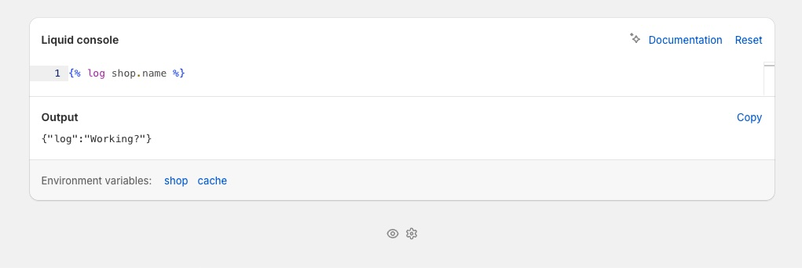

# Liquid console

The **Liquid console** is a scratchpad for testing [Mechanic Liquid](../platform/liquid/) code. It's available in the footer of every page of the Mechanic app — look for it at the bottom of the screen.

Type any Liquid code, submit it, and see the output immediately. This is useful for experimenting with filters, testing snippets from a task, or inspecting data available for a specific event.


Most Mechanic users don't need the Liquid console day-to-day. It's mainly useful when writing or debugging task code, or when support asks you to inspect event data.


<figure><figcaption></figcaption></figure>


The console can make Shopify Admin API requests (up to 10 per submission), which [task previews](../core/tasks/previews/) cannot. However, it has tighter memory limits than actual task runs. If you reach a limit, try testing your code in a task subscribing to mechanic/user/trigger instead.


## Inspecting event data

When viewing a specific event in the Mechanic app, the console has access to that event's data — the same variables your tasks had when they processed it. This makes it a useful debugging tool.

For example, on a shopify/orders/create event page, you could use `` to inspect the contents of an order's first line item.


Looking at a child event? Try using `` in the console to inspect data available from the parent. Or, to examine data from an ancestor event further back, try ``.

