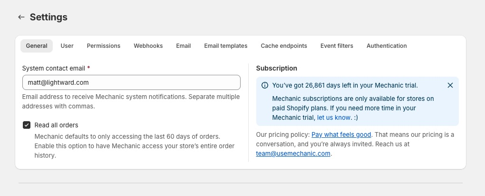

# Settings

The Settings page is organized into tabs covering different areas of your Mechanic configuration.

<figure><figcaption></figcaption></figure>

## General

* **System contact email** — receives Mechanic system notifications (rate limit warnings, service announcements). Supports multiple addresses separated by commas.
* **Read all orders** — by default, Mechanic accesses the last 60 days of order history. Enable this to access your full order history. Learn more in [Read all orders](../platform/shopify/read-all-orders.md).
* **Subscription** — your current plan and billing status.

## User

* **Use Advanced mode by default** — open the [task editor](task-editor.md) in Advanced mode instead of Basic mode
* **Show shop identity banner** — display a banner identifying the current shop (helpful when managing multiple stores)
* **Use dark theme for code editor** — apply a dark theme to all code editors in the app

## Permissions

Manage the Shopify API [permissions](../core/tasks/permissions.md) Mechanic uses. Mechanic automatically detects which scopes your tasks need — no manual scope management is required in most cases.

For advanced use cases, you can provide a **custom Shopify API token** from a private or custom Shopify app.

## Webhooks

Create [webhooks](../platform/webhooks.md) to send events to Mechanic from external systems. Each webhook gets a unique URL and maps to an event topic (e.g., `user/form/submitted`).

## Email

* **Default outbound email** — the auto-assigned email address Mechanic uses for sending, with DNS/SPF/DKIM status
* **Custom outbound email** — use your own domain, verified via DNS records. See [Custom email addresses](../platform/email/custom-email-domain.md).

## Email templates

Create reusable HTML [email templates](../platform/email/templates.md) for use in tasks. Templates support Liquid variables.

## Cache endpoints

Create public HTTP endpoints that expose [cached data](../platform/cache/) from your tasks. Each endpoint maps a cache key to a URL that returns the current value as JSON.

## Event filters

Liquid scripts that run before tasks to decide whether an event should be processed. Returning `false` skips the event entirely. See [Event filters](../platform/events/filters.md).

## Authentication

Manage OAuth connections for third-party [integrations](../platform/integrations/) — Google, Airtable, and Slack. Connected accounts store encrypted access tokens so your tasks can interact with these services without embedding API keys.
