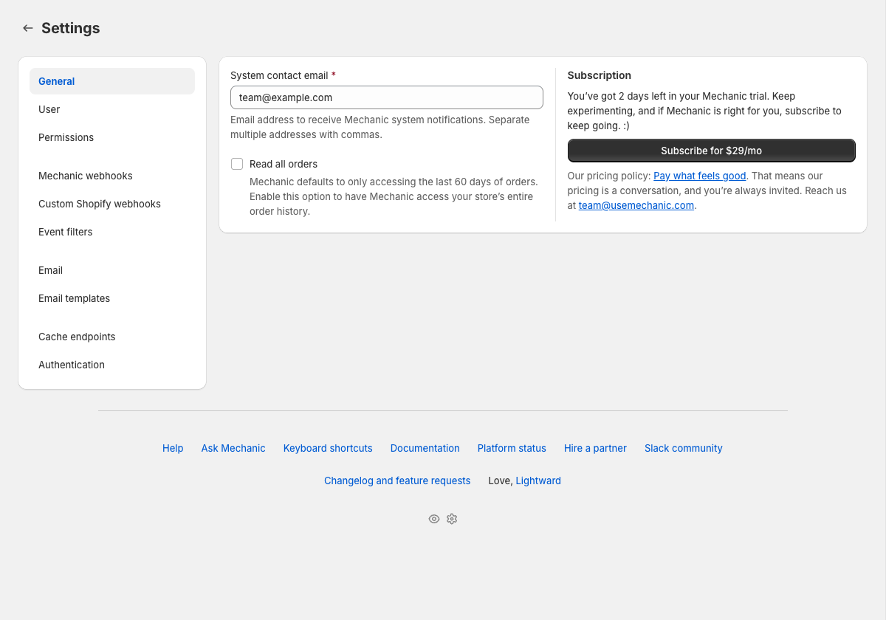
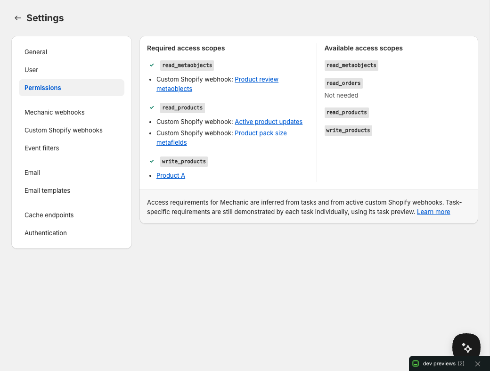

# Settings

The Settings page is organized into sections, accessed from the sidebar on the left or a dropdown on smaller screens. General and User cover common account preferences; the rest only matter if you're using the feature they're named after.

<figure><figcaption></figcaption></figure>

## General

* **System contact email** — receives Mechanic system notifications, like rate limit alerts or platform maintenance announcements. Supports multiple addresses separated by commas.
* **Read all orders** — by default, Mechanic accesses the last 60 days of order history. Enable this if you have tasks that need to search older orders. Learn more in [Read all orders](../platform/shopify/read-all-orders.md).
* **Subscription** — your current plan and billing status.

## User

* **Use Advanced mode by default** — open the [task editor](task-editor.md) in Advanced mode (for editing code) instead of Basic mode (for adjusting settings)
* **Show shop identity banner** — display a banner identifying the current shop (helpful when managing multiple stores)
* **Use dark theme for code editor** — apply a dark theme to all code editors in the app

## Permissions

Most of the time, Mechanic figures out the Shopify API scopes your tasks need from subscriptions, Shopify data access, and previewed Shopify actions. This section shows which scopes are already granted and which ones still need approval. When a task's needs are hard to prove during preview — for example, when a mutation's scope depends on a realistic resource ID, or logic only runs in a live branch — you can declare scopes directly with the [`permissions` tag](../platform/liquid/tags/permissions.md). Active [custom Shopify webhooks](../platform/shopify/custom-webhooks.md) can also contribute required scopes. See [Permissions](../core/tasks/permissions.md) for the full model.

<figure><figcaption></figcaption></figure>

## Mechanic webhooks

Inbound HTTP webhooks that let any external system (a form builder, a CRM, an ERP, a fulfillment service) trigger your tasks. Each webhook gets a unique URL you can POST data to, and incoming requests become `user/...` events. See [Mechanic webhooks](../platform/webhooks.md).

## Custom Shopify webhooks

Advanced Shopify-side filters and payload customization for supported Shopify webhook topics, routed onto a custom Mechanic event topic. Most tasks should use regular `shopify/...` subscriptions; reach for this when you want filtered deliveries, slim payloads, Shopify-side metafield filtering or delivery, or [metaobject webhooks](../platform/shopify/custom-webhooks.md#how-do-i-receive-shopify-metaobject-webhooks-in-mechanic) (which native subscriptions don't cover). See [Custom Shopify webhooks](../platform/shopify/custom-webhooks.md).

If you're not sure which path you want: most data coming from Shopify should use a regular `shopify/...` task subscription. Use Custom Shopify webhooks only when Shopify should filter or reshape the delivery before Mechanic receives it. Data coming from anywhere else should use Mechanic webhooks.

## Event filters

Advanced. Liquid code that runs before tasks to decide whether an event should be processed — for example, skipping test orders or pausing processing during maintenance. See [Event filters](../platform/events/filters.md).

## Email

* **Default outbound email** — the auto-assigned email address Mechanic uses for sending, with email verification status
* **Custom outbound email** — use your own domain, verified via DNS records. See [Custom email addresses](../platform/email/custom-email-domain.md).

## Email templates

Optional. Reusable HTML [email templates](../platform/email/templates.md) for use in tasks. Templates support Liquid variables.

## Cache endpoints

Only needed if external apps need to read data from your tasks. Create URLs that return [cached](../platform/cache/) task data as JSON — useful for dashboards or integrations that need to pull information from Mechanic.

## Authentication

Only needed if your tasks use Google Sheets, Airtable, or Slack integrations. Connect your accounts here so tasks can interact with those services. Credentials are encrypted and stored securely. See [Integrations](../platform/integrations/).
