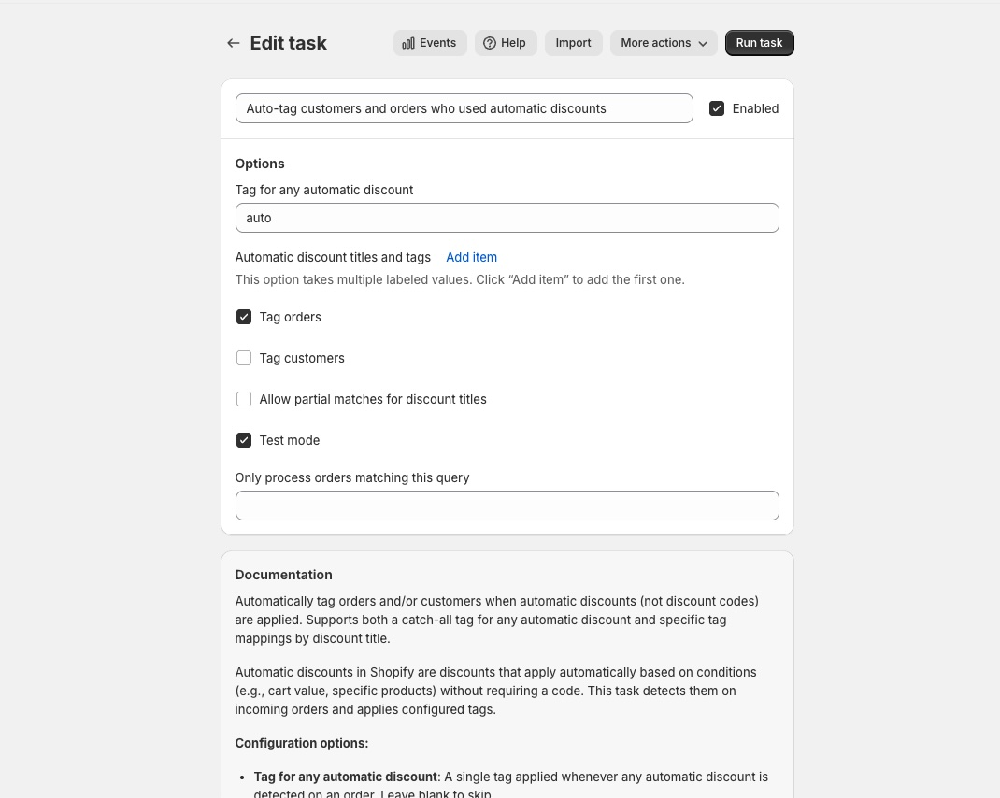
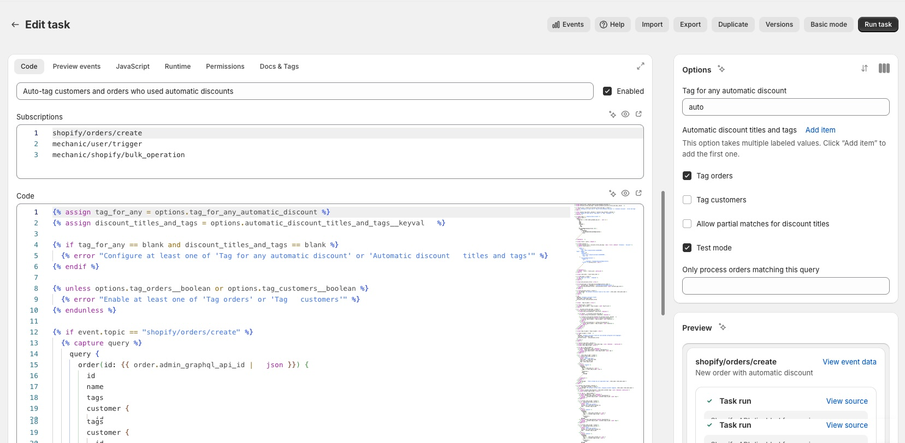

# Task editor

The task editor is where you configure and write Mechanic [tasks](../core/tasks/). It has two modes: **Basic** for adjusting a task's settings, and **Advanced** for editing code, testing with preview events, and managing runtime behavior.

Switch between modes using the **Advanced/Basic mode** toggle in the page actions menu. You can set your default in [Settings](settings.md).


If you're using tasks from the [task library](../resources/task-library/) and only need to adjust their settings, Basic mode is all you need. Advanced mode is for writing or editing task code.


## Basic mode

<figure><figcaption></figcaption></figure>

Basic mode displays the task's settings and documentation, with no code visible. Use it to configure a task's [options](../core/tasks/options/) — the fields that control how the task behaves (e.g., which tag to apply, which email to send to).

## Advanced mode

<figure><figcaption></figcaption></figure>

Advanced mode provides a tabbed editor with a sidebar showing **Options** and a live **Preview** of the actions your task will perform based on your code.

### Code tab

The main editing surface:

* **Subscriptions** — the Shopify events (like order creation or fulfillment) that trigger this task, one per line. Supports [offsets](../core/tasks/subscriptions.md) for delays (e.g., `shopify/orders/create+1.hour`).
* **Code** — the task's [Liquid code](../platform/liquid/), written in Mechanic's implementation of the Liquid language (related to but distinct from Shopify theme Liquid)

### Preview events tab

Create test events to see how your task will behave without affecting real data. You can define multiple preview events per topic to test different scenarios, label them with descriptions, and use [stub data](../core/tasks/previews/stub-data.md) (hardcoded sample data that stands in for real API responses) to mock Shopify API responses. The task [preview](../core/tasks/previews/) updates automatically as you edit, showing generated actions, errors, and any Shopify permission changes.

### JavaScript tab

Add JavaScript that runs in your customers' browser on the online storefront or order status page. Most tasks don't use this — it's for tasks that need client-side interactivity.

### Runtime tab

* **Shopify Admin API version** — which [API version](../core/shopify/api-versions.md) the task uses
* **Perform action runs in sequence** — by default, Mechanic runs all of a task's actions in parallel. Enable this to run them one at a time, which is useful when later actions depend on earlier ones.
* **Halt the sequence when one fails** — stop processing remaining actions if one fails

### Permissions tab

A read-only view of the Shopify API [permissions](../core/tasks/permissions.md) your task requires. Mechanic scans your code and preview events to determine these automatically — you don't need to manage them manually.

### Docs & Tags tab

Add tags to organize your task, and write Markdown documentation with a live preview.

## Page actions

The actions menu in the page header includes:

* **Events** — view all events processed by this task
* **Import / Export** — paste a JSON task export, or copy this task as JSON. Learn more in [Import and export](../core/tasks/import-and-export.md).
* **Duplicate** — create a copy of the task
* **Versions** — view and restore previous versions of the task

## Running a task

If your task subscribes to `mechanic/user/trigger`, `mechanic/user/text`, or `mechanic/user/form`, a **Run task** button appears in the page header.

* **Trigger tasks** run immediately with one click
* **Text tasks** prompt for a text input
* **Form tasks** show a form with fields defined by the task's [user form](../core/tasks/user-form.md) options
