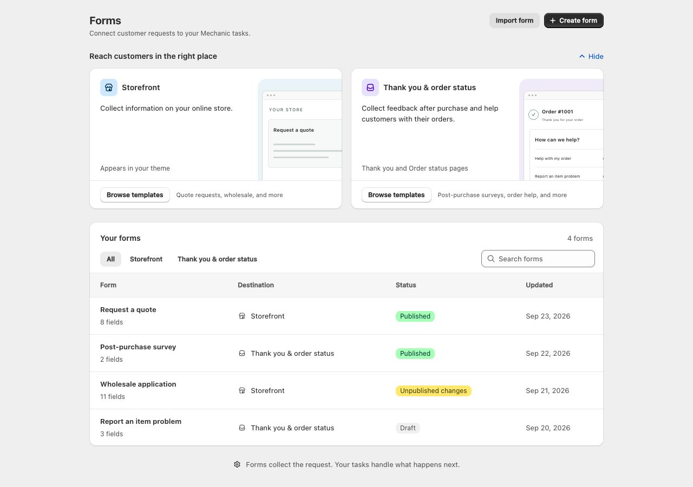
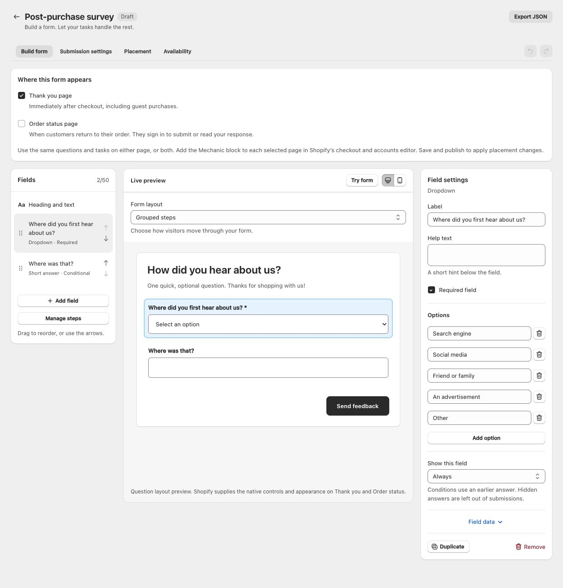
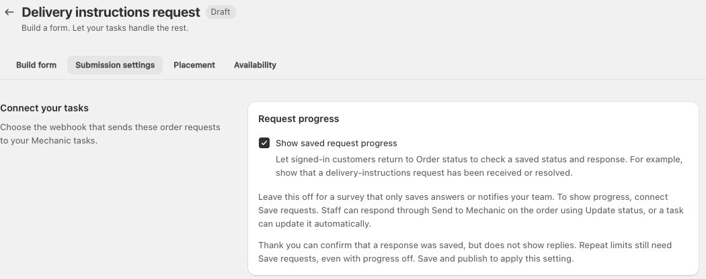

# Thank you and Order status forms

Ask how someone found your store, collect delivery details, or let a customer report a problem with an item they purchased. Thank you and Order status forms connect those responses to your Mechanic tasks.

Open **Forms** in Mechanic and choose **Thank you & order status**. The same form can appear on Thank you, Order status, or both. Your tasks decide what happens next: save a survey to Google Sheets, notify your team, or track a request and share a response with the customer.

<figure><figcaption>
Choose where to reach customers. Both categories use the same Forms workspace.
</figcaption></figure>

## Choose where the form appears

| Placement | When customers see it | Who can submit |
| --- | --- | --- |
| Thank you | Immediately after checkout | Customers from that recent checkout, including guest buyers |
| Order status | When customers return to their order | Customers who sign in and own the order |

Mechanic checks the order context before accepting a submission. Thank you forms are available during the first hour after the order is created. They do not show previous answers or staff replies. To read a saved reply later, the customer signs in on Order status, and the form must have that placement and saved request progress enabled.

Adding the block to one Shopify page does not add it to the other. [Storefront forms](forms.md), placed in your theme, are a separate destination. Thank you and Order status forms do not appear during the payment steps or change checkout requirements.

## Start with a template

1. Open **Forms → Create form**, choose **Thank you & order status**, and select a template or start from scratch.
2. Under **Where this form appears**, select **Thank you page**, **Order status page**, or both.
3. Edit the questions and confirmation message. Use **Try form** to check the question flow without sending a submission.
4. In **Submission settings**, choose a [Mechanic webhook](../platform/webhooks.md) and configure the tasks that will receive it.
5. Save and publish when the questions, tasks and availability settings are ready. Publishing is separate from saving a draft.

| Template | Starting placement | Use it for |
| --- | --- | --- |
| Post-purchase survey | Thank you | Ask how customers heard about your store, with a conditional Other question |
| Help with my order | Order status | Collect an order-related question |
| Change personalization details | Both | Collect a requested correction while the order is unfulfilled |
| Delivery instructions request | Both | Collect delivery instructions for an unfulfilled order |
| Report an item problem | Order status | Let customers select a purchased item and describe the problem |

These starters collect information. They do not automatically change, cancel, refund, or fulfill an order. Customers' requested changes still need the appropriate task or staff review.

<figure><figcaption>
Use the same questions and tasks on one page or both. Save and publish to apply placement changes.
</figcaption></figure>

Questions support steps, conditional fields and one-question-at-a-time layouts. **Items from the order** lets customers select from their purchased items; Mechanic checks that submitted item IDs belong to the order. Shopify provides the native controls and appearance on these pages. The builder preview illustrates the questions, rather than reproducing Shopify's final page. File uploads and saving answers to the cart are not available for Thank you and Order status forms.

## Send a survey to Google Sheets

A survey does not need a staff reply or request tracking. The **Post-purchase survey** template starts with **Show saved request progress** off and **Allow anytime** for repeat submissions.

1. Create a webhook dedicated to this survey, and select it in **Submission settings**.
2. Install [Save Mechanic form submissions to a Google Sheet](https://tasks.mechanic.dev/save-mechanic-form-submissions-to-a-google-sheet). Set its **Webhook event topic** to the survey webhook's exact topic.
3. Leave that task's optional **Form** filter blank; its picker lists storefront forms. The dedicated topic keeps this task limited to the survey.
4. Configure the Google connection and destination sheet. Map the columns to the field keys `discovery_source` and `discovery_other`, or the keys you used in your form.
5. Save and enable the task. Publish the form, place its block, then submit a real test response and check the event, task result and spreadsheet row.

The confirmation means the response was sent, not that the spreadsheet write has finished. You can also email your team using the companion email task below, without enabling request tracking.

## Track requests and respond to customers

Use the companion tasks when a submission needs follow-up:

| Task | What it does |
| --- | --- |
| [Save a Mechanic Order status request](https://tasks.mechanic.dev/save-a-mechanic-order-status-request) | Saves the latest accepted request for this form on the order, with an initial status and customer-facing message |
| [Email a Mechanic Order status request](https://tasks.mechanic.dev/email-a-mechanic-order-status-request) | Emails the request to your team; it can run independently of the save task |
| [Update a Mechanic Order status request](https://tasks.mechanic.dev/update-a-mechanic-order-status-request) | Lets staff update a saved request's status and customer-facing message from the order |

Choose the published form in each task's **Form** option. For receiving tasks, use the form webhook's exact topic. Follow the save task's one-time setup instructions to create request storage, approve the required permissions, and enable the tasks.

In **Submission settings**, turn on **Show saved request progress** if customers should see a saved status or reply. Thank you can confirm delivery of that submission; signed-in customers can read status and replies on Order status. Turning progress off hides those controls but does not disable the receiving tasks.

<figure><figcaption>
Leave progress off for a simple survey. Enable it when customers need to check a saved request.
</figcaption></figure>

To respond today, open the order in Shopify, choose **More actions → Send to Mechanic**, select the configured update task, enter its **Status** and **Customer message**, and run it. See [Shopify admin action links](../core/shopify/admin-action-links.md). The task can optionally email the owning customer after a successful update; **Send customer email** is off by default. Never put private staff notes in the customer-facing message.

Tasks can also maintain the saved status automatically when another event occurs. Different forms can have different tasks. The built-in display shows the latest saved request for each form and order; it is not a conversation history or staff inbox. The supplied tasks do not create a follow-up tag, saved Orders view, or separate Respond action.

## Decide when another response is allowed

Under **Availability**, choose **After the previous request is resolved or declined**, **Allow anytime**, or **One request per order**. The rule is shared across both placements for the same form and order.

Repeat limits need the save task, even when saved progress is hidden. **After the previous request is resolved or declined** requires the saved status to be **Resolved** or **Declined** before another request can be accepted. For a once-per-order survey, choose **One request per order** and connect the save task. Leaving the survey on **Allow anytime** allows it to use Sheets alone.

You can also limit new submissions by customer/order tags, purchased products or variants, fulfillment status, and order age. Combine conditions using all/any matching. Mechanic checks them when loading the form and authorizing a submission. Closing submissions or losing eligibility can leave the saved reply visible on Order status when progress is enabled. Unpublishing the form removes it from both pages.

## Add the block and test it

Open Shopify's checkout and accounts editor. Add the **mechanic-order-status** app block to each selected page: Thank you and/or Order status. Save the editor. One block lists that page's eligible published forms; you do not choose an individual form inside the block. The **Placement** tab in Mechanic guides this setup.

Test Thank you with a new purchase, including a guest purchase. Test Order status by returning to an order and signing in as its customer. The editor preview and Mechanic's **Try form** do not send real submissions. Check the resulting Mechanic event and task/action results, then check the actual destination. For tracking, update a saved request and check that the customer can read the correct response.

If an order is not readable immediately after checkout, the block makes a few bounded attempts and then offers a retry. If delivery is uncertain, retrying the current submission reuses its authorized request; leaving the form and starting again can create another submission. Emails and other actions are not guaranteed to run exactly once on redelivery.

## Update, copy, or stop a form

Save edits to keep a draft; choose **Publish changes** to apply them to customers, including placement and availability changes. Existing Order status forms do not appear on Thank you until that placement is selected and published.

JSON export/import preserves the questions, placement and progress choices. Imports create an unpublished draft; choose the destination shop's webhook and set up its tasks separately. Product and variant conditions must be reselected for the destination shop. Placement in Shopify's editor is not copied.

To close new requests while retaining visible saved replies, turn off **Accept new submissions**, save and publish. Unpublish to hide the form entirely. Disabling a task does not unpublish the form or stop other tasks on the same topic. Previously queued events may still run, and saved order data is not removed when a form is unpublished or deleted.

System labels currently ship in English. Merchant-authored questions, status labels and replies are not translated automatically.
