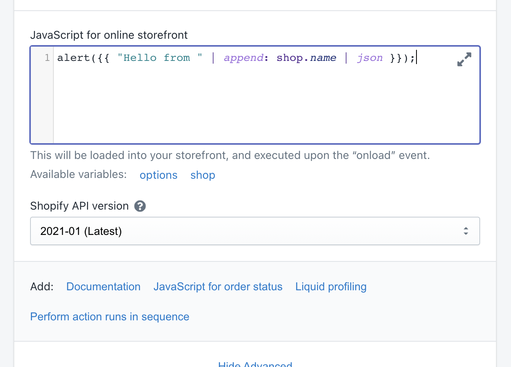

# JavaScript

Shopify allows apps to inject JavaScript into the online storefront, and into order status pages. \(This is facilitated by [ScriptTag](https://shopify.dev/docs/admin-api/rest/reference/online-store/scripttag) in the Shopify API.\)

Mechanic supports this by allowing each task to specify its own JavaScript, to be injected into the online storefront or into order status pages. This feature is available towards the end of the task's advanced settings.

Once enabled for a task, the developer can add in their own JavaScript code, taking advantage of Liquid for mixing in data from the current store, or from the current task's options.


A task's JavaScript content only has access to to the `shop` and `options` Liquid variables. The rendering context is similar to that of [task subscriptions](../subscriptions.md#using-liquid); Liquid code here does not have access to any data related to events, and cannot dynamically respond to any information about the visitor's current request.


