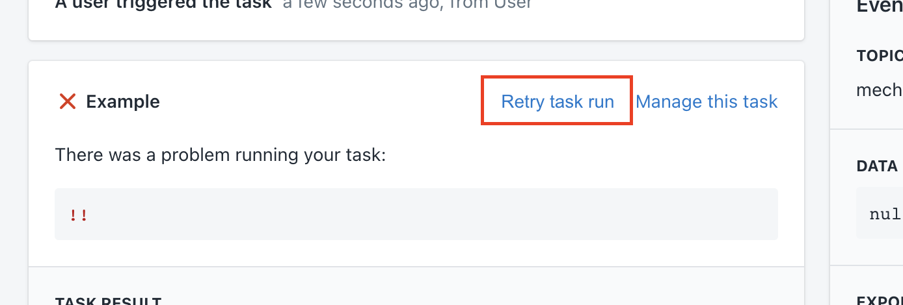

# Retries

In some cases, a run that has already been performed may be performed again, using a **retry**.

When a run is retried, its previous result is permanently discarded. Because of this, runs that already have a meaningful result \(i.e. an event run that gave rise to task runs, or a task run that generated actions, or an action run that succeeded\) cannot be retried.

Runs are given **automatic retries** when a non-permanent error is encountered. In some cases, Mechanic permits **manual retries** for runs, allowing users to reset a run's result and perform the run again.

## Retry context

Retried event runs will always reflect Mechanic's current configuration, including any [event filters](../../platform/events/filters.md).

Retried task runs will always use a task's latest configuration, including the task's [options](../tasks/options/), [code](../tasks/code/), and [Shopify API version](../tasks/shopify-api-version.md).

Retried action runs will always use their original action options, as dictated by the task run that generated them. Action runs are entirely unaffected by updates to their task.


Outstanding task and action runs that belong to a newly-disabled task will always fail when performed, whether they're retried or performed normally. This means that disabling a task ensures that it will not perform any work, even if it has task or action runs already scheduled.


## Automatic retries

When non-permanent errors are encountered, Mechanic will automatically retry a run. For [HTTP actions](../actions/http.md), this might be a connection error. For [Email actions](../actions/email.md), this might be a temporary outage with our email provider.

Mechanic will automatically retry these runs up to 4 times, for a total of 5 attempts. Retries are subject to a variable backoff delay, of approximately 0:30, 1:16, 2:32, and 5:08 respectively, for each of the 4 retries.

## Manual retries

Some task runs may be manually retried, via the Mechanic user interface.

### Task runs

Task runs may be retried...

* ... if the task run itself failed \(due to a Liquid error, an API error while reading data, or something else\)
* ... or, if the task run did not generate any actions

During task development, it can be useful to set up a task to only render [log objects](../tasks/code/log-objects.md). A task run which only rendered log objects can be retried, and this ability to retry can be convenient when rapidly iterating on task code.

### Action runs

Only failed action runs may be retried.

