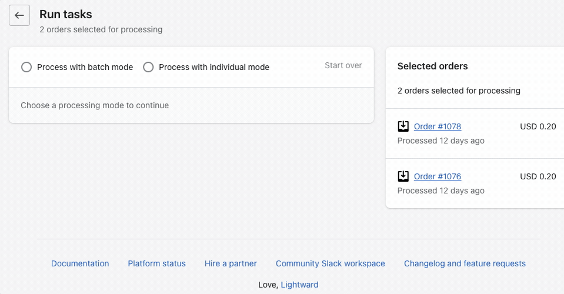
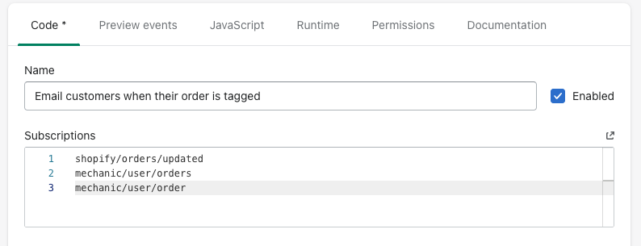

# Shopify admin action links

For supported resources, you'll find **"Send to Mechanic"** links within the Shopify admin. These links point to a Mechanic app URL that translates selected Shopify resources into Mechanic events for on-demand processing. Depending on the user's resource and task selections, their submission may result in one or more new events. Event data consists of the latest stable REST Admin API representation of the selected resource(s).

Tasks can qualify for this style of on-demand Shopify resource processing by subscribing to event topics like **mechanic/user/{resource}** (singular) for individual processing, and **mechanic/user/{resources}** (plural) for batch processing. See [Supported resources](admin-action-links.md#supported-resources) below for a complete table of resources and event topics.

Shopify admin action links are a form of [**run link**](../../platform/integrations/run-links.md), and as such equivalent URLs may be constructed manually using known resource IDs. For example, an admin order notification email could be written to include such a link, allowing the email recipient to send the relevant order to Mechanic.

## Supported resources

| Resource                                                                                      | Resource type URL parameter | Individual mode event topic       | Batch mode event topic             |
| --------------------------------------------------------------------------------------------- | --------------------------- | --------------------------------- | ---------------------------------- |
| [Customer](https://shopify.dev/api/admin-rest/latest/resources/customer)                      | `customer`                  | mechanic/user/customer            | mechanic/user/customers            |
| [Order](https://shopify.dev/api/admin-rest/latest/resources/order)                            | `order`                     | mechanic/user/order               | mechanic/user/orders               |
| [Draft order](https://shopify.dev/api/admin-rest/latest/resources/draftorder)                 | `draft_order`               | mechanic/user/draft\_order        | mechanic/user/draft\_orders        |
| [Abandoned checkout](https://shopify.dev/api/admin-rest/latest/resources/abandoned-checkouts) | `abandoned_checkout`        | mechanic/user/abandoned\_checkout | mechanic/user/abandoned\_checkouts |
| [Product](https://shopify.dev/api/admin-rest/latest/resources/product)                        | `product`                   | mechanic/user/product             | mechanic/user/products             |
| [Product variant](https://shopify.dev/api/admin-rest/latest/resources/product-variant)        | `variant`                   | mechanic/user/variant             | mechanic/user/variants             |
| [Collection](https://shopify.dev/api/admin-rest/latest/resources/collection)                  | `collection`                | mechanic/user/collection          | mechanic/user/collections          |

## Processing modes

Mechanic distinguishes between "individual" and "batch" modes to enable a greater variety of possible workflows. Some tasks may benefit from having knowledge of all selected resources at the same time within the same task run, while some tasks may be more suited to receiving a single resource at a time.

For example, tasks that are created to print deliberately-sorted pick lists might benefit from batch mode, whereas tasks aimed at refunding specific orders might benefit from individual mode.

### Individual mode

This mode creates an event for each selected Shopify resource, resulting in as many events as there were selected resources. Tasks subscribing to an individual mode event topic (e.g. mechanic/user/order or mechanic/user/customer) may use an [environment variable](../tasks/code/environment-variables.md) named after the singularized resource name, e.g. `order` or `customer`.

```liquid



```

### Batch mode

This mode creates one (1) event whose data consists of an array holding all selected Shopify resources, up to a maximum of 50 resources total. No matter how many resources were selected, only one event is created. Tasks subscribing to a batch mode event topic (e.g. mechanic/user/orders or mechanic/user/customers) may use an [environment variable](../tasks/code/environment-variables.md) named after the pluralized resource name, e.g. `orders` or `customers`.

```liquid


   


```

## Link usage

### 1. Selecting resource(s)

For supported Shopify resources, the "Send to Mechanic" action link can be found in the "More actions" menu. Click this link to route the currently-viewed Shopify resource to Mechanic.

<figure><figcaption><p>A Shopify admin action link on the details page for a specific order</p></figcaption></figure>

For supported Shopify resources, the "Send to Mechanic" link is also available as a [bulk action](https://help.shopify.com/en/manual/shopify-admin/productivity-tools/bulk-actions), supporting selections of up to 50 resources at once. Find the "Send to Mechanic" link after in the menu of additional actions, in the floating action list that appears after selecting one or more resources.

<figure><figcaption><p>A Shopify admin action link on a list of orders</p></figcaption></figure>


Sending one (1) resource to Mechanic via bulk action (on a resource list page) is the same as sending an individual resource to Mechanic via the "More actions" menu (on that resource's detail page). The two paths arrive in the same place, and the choice between batch mode and individual mode is available either way.



Shopify admin action links are a form of [run link](../../platform/integrations/run-links.md), following this pattern:

```
https://store.myshopify.com/admin/apps/mechanic/tasks/run?resource_type=$RESOURCE_TYPE&ids[]=123&ids[]=456
```

These URLs may be manually constructed, using resource type parameter values drawn from the [Supported resources](admin-action-links.md#supported-resources) table above, and using integer REST resource IDs.


### 2. Configuring task run(s)

Using a Shopify admin action link brings the user to the page shown below, in which selected resources are shown for preview, and a choice of [processing mode](admin-action-links.md#processing-modes) is offered.

<figure><figcaption><p>Select to send your resources as an array of resources in a single event, or as a single resource in many events</p></figcaption></figure>

After selecting a processing mode, select from the available compatible tasks – i.e. from enabled tasks that subscribe to a relevant event topic. You can send this event to one or more tasks that subscribe to the correct event topic.

## Task usage

To qualify a task to receive these events, subscribe to an event topic from the [Supported resources](admin-action-links.md#supported-resources) table above.

For these events, Mechanic makes available an [environment variable](../tasks/code/environment-variables.md) named after the third term in the event topic. For example, a mechanic/user/order event will make available a variable called `order`, which contains an [Order object](../../platform/liquid/shopify/order.md) with data pulled from the Shopify Admin REST API. By contrast, a mechanic/user/orders event will make available a variable called `orders`, which contains an array of Order objects.


Event data for these topics is often very similar to data from [Shopify events](events/), but there are occasionally differences. For example, shopify/orders/\* events do not include customer data. By contrast, customer data is included in the Shopify Admin REST API representation for the Order resource. Therefore, event data for mechanic/user/order and mechanic/user/orders events _do_ contain information about the customer, unlike shopify/orders events.


<figure><figcaption><p>Your task subscriptions will make them eligible to recieve these events from the Shopify admin</p></figcaption></figure>

### Retrofitting existing tasks

Tasks that already subscribe to related Shopify event topics lend themselves well to invocation via Shopify admin action links. For example, a task subscribing to shopify/orders/create may be adapted to these action links by adding mechanic/user/order to the task's subscriptions.


Additional changes may be necessary. Always test thoroughly, and follow [best practices](https://learn.mechanic.dev/techniques/writing-a-high-quality-task).


#### Example

The [Send a PDF invoice when an order is created](https://tasks.mechanic.dev/send-a-pdf-invoice-when-an-order-is-created) task, from the Mechanic task library, is well-suited to this kind of adaptation. To illustrate, here is the portion of the task code that addresses the order itself:


```liquid


  
    {
      "to": {{ order.email | json }},
      "subject": {{ options.email_subject__required | strip | json }},
      "body": {{ options.email_body__multiline_required | strip | newline_to_br | json }},
      "reply_to": {{ shop.customer_email | json }},
      "from_display_name": {{ shop.name | json }},
      "attachments": {
        {{ options.pdf_attachment_filename__required | json }}: {
          "pdf": {
            "html": {{ options.pdf_html_template__code_multiline_required | json }}
          }
        }
      }
    }
  


```


Because this task straightforwardly references the `order` environment variable, this task is a good candidate for a subscription to mechanic/user/order. Once modified in that way, the task will be able to send PDF invoices on demand, whenever a user sends orders to the task via a "Send to Mechanic" link.
