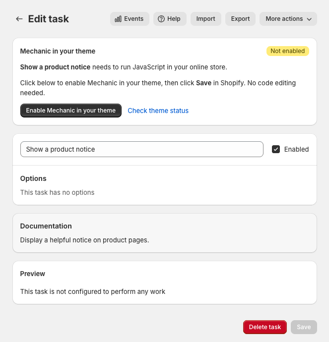

# JavaScript

Tasks can use JavaScript to add functionality to your online store, such as displaying a banner or connecting a contact form to Mechanic. You configure the JavaScript in each task. Enabling Mechanic in your theme lets that code run on your storefront.

## Enable Mechanic in your theme

When an enabled task needs JavaScript in your online store, Mechanic shows a **Mechanic in your theme** card if setup needs your attention. You'll find it on the task page and on the Mechanic homepage, where it lists the tasks that need it.

1. Click **Enable Mechanic in your theme**. This opens your published theme in Shopify's theme editor in a new tab.
2. Make sure Mechanic's **Online store JavaScript** is turned on in **App embeds**, then click **Save** in Shopify.
3. Return to Mechanic. The setup card disappears once Mechanic confirms the saved setting. If it hasn't refreshed, click **Check theme status**.

You only need to do this once for your current theme. The same setting loads JavaScript for all your enabled tasks, including tasks you add later. Enabling it doesn't require editing theme code. Some tasks have additional setup of their own, such as adding a button or configuring a webhook; follow the task's instructions too.


If your store doesn't already have Mechanic loading JavaScript, the task's storefront functionality won't work until you enable Mechanic in your theme and save. Other parts of the task may still run.


## Existing tasks

If your tasks already use Mechanic's older JavaScript integration, they can keep running while you complete theme setup. Enable Mechanic in your theme, save, and return to the app. Mechanic loads the same task code and removes its old integration in the background after confirming activation in your published theme. You don't need to remove anything manually, edit task code, or reinstall or update library tasks for this change.

Shopify is retiring the older integration, called ScriptTags. Existing ScriptTags stop running on **March 1, 2027**, so complete theme setup before then. [Read Shopify's announcement](https://shopify.dev/changelog/online-store-script-tags-deprecation).

## Disabling tasks and changing themes

You can leave Mechanic enabled in your theme when you disable a task. That task's JavaScript won't run on subsequent page loads; code that already ran in an open page isn't undone. Other enabled tasks keep working.

If there are no enabled tasks with JavaScript, there's no theme setup card. Once setup is complete, the card also disappears.

After publishing a different theme, open Mechanic and check whether it asks you to enable Mechanic in that theme. Saving the setting in a draft theme alone doesn't complete setup for your published theme. If you turn Mechanic off in your published theme after moving to the new integration, your tasks' storefront JavaScript stops loading and Mechanic asks you to enable it again.

To test a task, open your storefront outside the theme editor and check its behavior on the published theme.

## Write task JavaScript

Use the task editor's **JavaScript for Online Storefront** field. In the advanced task editor, open the **JavaScript** tab. The code stays in the task; you don't need to paste it into your theme.

You can use Liquid to include data from the store or the task's options. Mechanic renders that Liquid before delivering the JavaScript to the storefront.


A task's JavaScript content only has access to the `shop` and `options` Liquid variables. The rendering context is similar to that of [task subscriptions](../subscriptions.md#using-liquid): Liquid here cannot access event data or information about the visitor's current request. The resulting JavaScript runs in the visitor's browser and can read the page as usual.


This feature is for the online store. It does not add JavaScript to checkout or order status pages.
