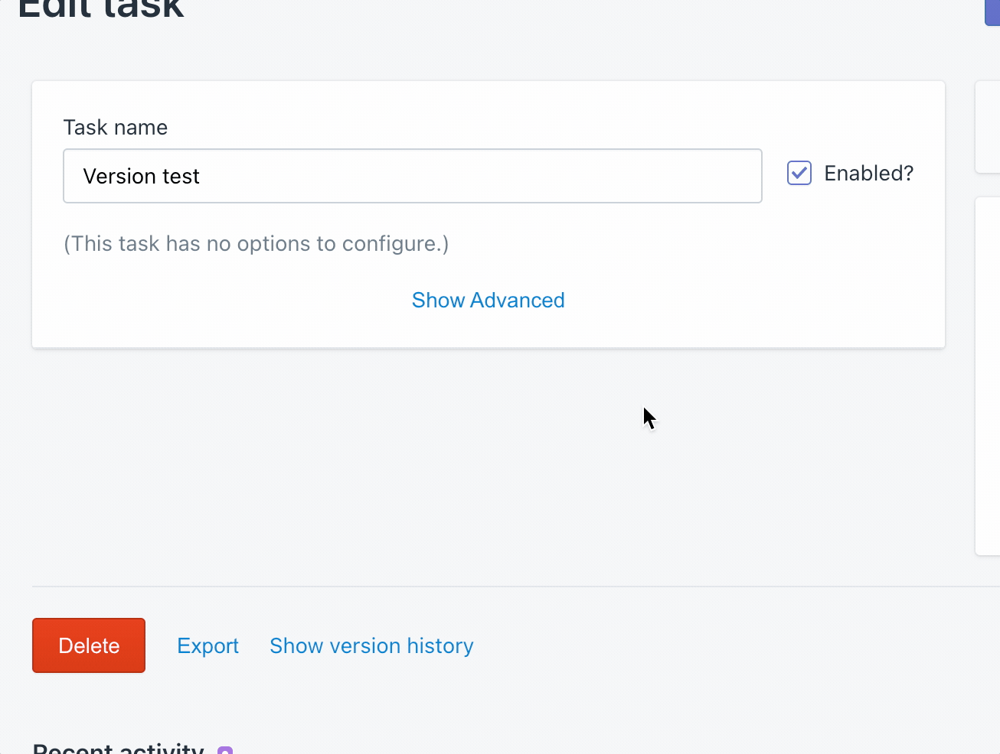

# Shopify API version

Each task is configured with a specific [**Shopify API version**](../shopify/api-versions.md), defaulting to the latest version at the time of the task's creation.

This version is used in all activity related to the current task, including:

* REST API calls performed to support Liquid lookups
* GraphQL calls performed by [the shopify Liquid filter](shopify-api-version.md)
* All Shopify API calls performed by [the Shopify action](../actions/integrations/shopify.md), including [bulk operations](shopify-api-version.md)


When a task run starts, it checks the Shopify API version configured for the task at that time. Action runs always inherit their Shopify API version from their task run. This means that changing a task's Shopify API version can affect queued task runs, but won't change queued action runs.


## Using "unstable"

All Shopify API versions are named with a specific date (i.e. "2021-07"), except for "unstable". This version receives regular updates from Shopify, and its features may change without notice.

Most tasks should use a dated version, to maximize the amount of time a task can rely on a specific set of Shopify API features.

## Automatic version upgrades

Shopify supports each version for 12 months (except for "unstable", which is always available). 30 days before a task's version becomes unsupported, Mechanic will automatically begin calling the closest supported version instead.

Shopify may, at times, mark certain API features as deprecated. If a Mechanic account calls a deprecated API, Mechanic will display the deprecation notice in the app. Learn more about [Shopify API deprecations](../shopify/api-versions.md#deprecations).

## Changing versions

The selector for a task's Shopify API version is available towards the end of the task's advanced settings.

