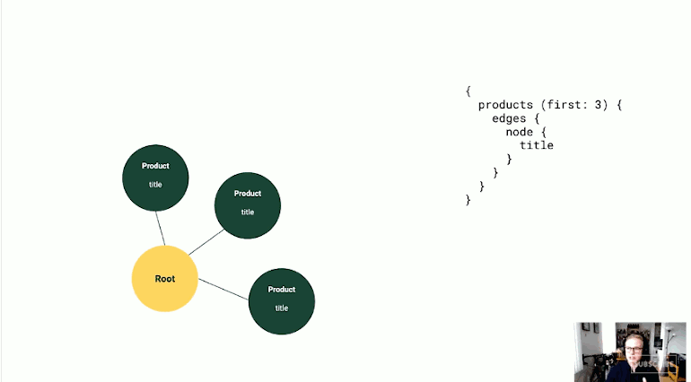

# Queries

GraphQL is a powerful query language that allows you to request data from a GraphQL server like Shopify's APIs. Queries are capable from requesting specific fields of single resources, nested resources, and lists of resources.

> A GraphQL API models data as nodes connected by edges. A node is an object that has a global ID, such as an Order object or Product object. You can fetch data about an individual node, or you can follow the edges to fetch data about a collection of related nodes. At each node, you specify the fields that you want to retrieve. - [https://shopify.dev/concepts/graphql/queries](https://shopify.dev/concepts/graphql/queries)

## Visualizing edges and nodes



## Request three fields from a specific product



```graphql
query {
  product(id: "gid://shopify/Product/1925886804024") {
    title
    description
    onlineStoreUrl
  }
}
```



```cpp
{
  "data": {
    "product": {
       "title": "t-shirt",
       "description": "This t-shirt comes in a range of colors.",
       "onlineStoreUrl": "https://test-shop.myshopify.com/products/t-shirt"
    }
  }
}
```



## Request the first three products in our store, including their first three variants



```graphql
query {
  products(first:3) {
    edges {
      node {
        id
        handle
        variants(first:3) {
          edges {
            node {
              id
              displayName
            }
          }
        }
      }
    }
  }
}
```



```cpp
{
  "data": {
    "products": {
      "edges": [
        {
          "node": {
            "id": "gid://shopify/Product/1321540321336",
            "handle": "ocean-blue-shirt",
            "variants": {
              "edges": [
                {
                  "node": {
                    "id": "gid://shopify/ProductVariant/12195005104184",
                    "displayName": "Ocean Blue Shirt - xs"
                  }
                }
              ]
            }
          }
        }
      ]
    }
  }
}
```



## Filtering results using search queries <a id="filtering-connections-using-a-search-query"></a>



```graphql
query {
  orders(first:2, query:"fulfillment_status:shipped") {
    edges {
      node {
        id
        name
        displayFulfillmentStatus
      }
    }
  }
}
```



```cpp
{
  "data": {
    "orders": {
      "edges": [
        {
          "node": {
            "id": "gid://shopify/Order/410479493176",
            "name": "#1592",
            "displayFulfillmentStatus": "FULFILLED"
          }
        },
        {
          "node": {
            "id": "gid://shopify/Order/410478542904",
            "name": "#1564",
            "displayFulfillmentStatus": "FULFILLED"
          }
        }
      ]
    }
  }
}
```



## Great resources for learning GraphQL queries

### Key concepts to read up on

* [ ] QueryRoot
* [ ] Fields
* [ ] Connections
* [ ] First and Last
* [ ] Nodes
* [ ] Edges
* [ ] Search query


[https://shopify.dev/concepts/graphql/queries](https://shopify.dev/concepts/graphql/queries)



[https://www.shopify.com/partners/blog/getting-started-with-graphql](https://www.shopify.com/partners/blog/getting-started-with-graphql)



[https://graphql.org/learn/queries/](https://graphql.org/learn/queries/)



[https://www.howtographql.com/basics/2-core-concepts/](https://www.howtographql.com/basics/2-core-concepts/)


