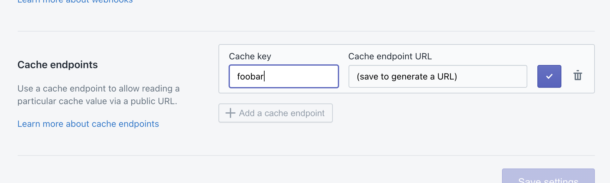

# Cache endpoints

Cache endpoints are private JSON APIs for accessing data from the Mechanic [**cache**](./). Like [webhooks](../webhooks.md), cache endpoints may be called from a Shopify online storefront (and from other origins). This makes for a flexible way to generate, collect, or transform data into something you can pull in to your online customer experiences.

Combining webhooks with cache endpoints creates a closed loop: webhooks receive data for processing, and cache endpoints can return data once processed.

Mechanic's cache endpoints include CORS support for all origins, making these requests available for use in online user experiences.

## Configuration

Cache endpoints may be configured in the Mechanic settings:



Enter the cache key, where the desired data has been stored, and save to receive a unique cache endpoint URL. The URL, when accessed, will return a JSON response containing the value associated with that cache key.

### Alternatives

Not all data can be JSON-encoded. To work around this restriction, use the [base64](../liquid/filters/#base-64-decode\_base64) Liquid filter to cache base64-encoded data.

Values cached in Mechanic have a maximum lifetime of 60 days. If data must be stored long-term, or is quite large, consider using the [FTP](../../core/actions/ftp.md) action in concert with a service like [Couchdrop](https://couchdrop.io/), to send data to a more appropriate storage location.

## Usage

Data for a cache endpoint must be populated using the [Cache action](../../core/actions/cache.md).

Data from a cache endpoint may be requested in any context. Here's an example, using fetch:

```javascript
fetch('https://usemechanic.com/cache/0000-0000')
  .then(response => response.json())
  .then(data => console.log('Received data from cache endpoint', data));
```
