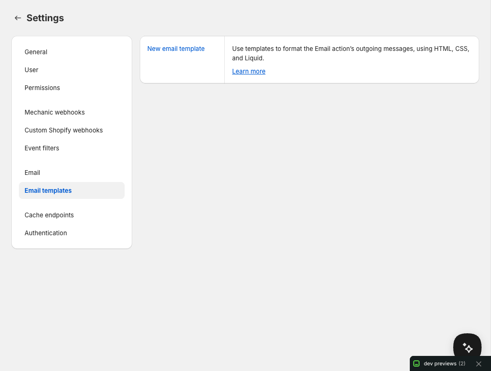

# Email templates

Give your task emails the same logo, colors, and layout as the emails your store already sends. Create a reusable template in **Settings → Email templates**, then use it with the [Email action](../../core/actions/email.md).

The template supplies the layout. The task supplies the recipient, subject, and message, including any calculated order or product details. Several tasks can share one template.

## Configuration

Open **Settings → Email templates**, then choose **New email template**. Give it a name you'll recognize when choosing it in a task.

When the visual editor is available for your shop, you can arrange sections and preview the layout without writing HTML. Existing HTML/Liquid templates keep their code editor.

### Start with an email you already send

Forwarding an existing email is the quickest way to get a familiar look:

1. Choose **Use an existing email** in the visual editor.
2. Forward one store email to the temporary address shown in the dialog. Use this address, rather than your shop's usual Mechanic incoming email address.
3. Review the original beside the suggested layout, and choose the logo you want to keep.
4. Choose **Use this look** to apply it to your draft. Adjust the sections, colors, and spacing as needed.

The address expires after 30 minutes. If it expires, start again to get a new one. These imports are separate from normal [incoming email](receiving-email.md): they do not trigger tasks.

If forwarding isn't available, or you already have a saved copy, choose an `.eml` or `.html` file in the same dialog. Imports can be up to 5 MB.

Importing borrows the email's appearance, such as its logo, colors, fonts, and width. It does not copy the original customer details, order content, or Shopify Liquid logic into your template. Review the suggested look before applying it; forwarding and importing never save the template automatically.

Images in the original preview load only when you choose to load them. Loading them contacts the original image host.

### Edit the layout

Add and arrange text, images, buttons, dividers, and spacing around the **Task message** section. This section marks where the task's message will appear. You can move it, but it must remain in the layout.

The sample message helps you judge the layout. It is replaced by the task's actual message when the task sends an email. Visual sections don't accept Liquid variables or repeating product lists; calculate those details in the task and include them in its message. HTML/Liquid templates remain available for custom template variables.

### Send a test email

Choose **Send test email** to see the current visual draft in your inbox before saving it.

1. Check the recipient. It starts with your signed-in staff email address, and you can change it to one other address.
2. Send the test, then look for **[Test] Email template** in that inbox.
3. Review the layout and images, adjust the draft, and save when you're happy with it.

The test uses a fixed sample message and your shop's configured sender. It includes your unsaved layout changes, but does not save the template or run a task. Up to ten template tests per shop per hour are allowed, in addition to the usual email sending limits.

To check a task's actual calculated message, use that task's email preview and **Send a copy**. Neither preview copies nor layout tests include attachments; see [How do I preview email attachments?](../../faq/how-do-i-preview-email-attachments.md).

If sending reports a problem, check your inbox before retrying: an uncertain response can occur after a message has been accepted for delivery.

### Images and Shopify Files

For an image section or logo, you can:

* **Choose from Shopify Files** to reuse an image from your shop. Shopify's picker also offers uploads.
* **Upload to Shopify Files** using the editor's separate upload control.
* Paste an existing public HTTPS image URL.

When prompted, choose **Enable Shopify Files**, approve access in the new tab, then return to the editor and choose **Check access**. If Mechanic already has Files access, another approval isn't needed. Pasting a hosted image URL doesn't require Files permission.

The separate upload control accepts PNG and JPEG files up to 2 MB and 4096 × 4096 pixels, with up to 20 upload attempts per shop per hour. Uploads inside Shopify's picker follow Shopify's own limits. Shopify hosts and processes the images; Mechanic requests a version up to 1200 pixels wide, without guaranteeing a particular file size.

Manage uploaded images in Shopify **Content → Files**. They are public files linked from the email, not email attachments. Deleting a template doesn't delete its images. Deleting a file can break images in emails you've already sent.

If you copy a template to another shop, its image URLs stay the same; the files aren't copied. Upload your own copy in the destination shop if you want that shop to control the images. See [How do I send images with my emails?](../../faq/how-do-i-send-images-with-my-emails.md) for images in task code and attachments.

## Specifying a template

### Choose a template in a task

If a task offers an **Email template** option, choose your saved template there. The picker lets you preview or open a template, or create/import one in a separate tab. After saving a new template, return to the task and choose **Refresh templates**.

**Preview template** shows the saved layout with sample content. It does not evaluate Liquid. Use the task's email preview to check its calculated content with the chosen template.

Start with [Demonstration: Send an email using a saved template](https://tasks.mechanic.dev/demonstration-send-an-email-using-a-saved-template). It sends one message when you run it manually, and shows how the task's message fits inside the saved layout.

Existing library tasks keep their current options and behavior. An email subject or body field doesn't automatically gain a template picker. A task author can [add one explicitly](../../core/tasks/options/README.md#email-template-picker).

In tasks with an optional picker, **Keep current behavior** leaves the task's existing template choice in place. Saving or importing a template doesn't change any task's selection.

### Select a template in code

Use the Email action's `template` option to choose a saved template by name:

```liquid

  {
    "to": "hello@example.com",
    "subject": "Hello world",
    "body": "It's a mighty fine day!",
    "template": "welcome"
  }

```

If `template` is omitted or `null`, Mechanic uses the template named `default`, if one exists. Set `"template": false` to send the body without a template. A missing named template other than `default` causes an error.

Each email action can choose its own template. A task with several email actions can share one picker, or expose separate pickers for different messages.

Template references use names. Renaming a template does not update tasks that use it, so update those references as part of a rename. Editing a saved template changes the layout for future emails that select it.

## Existing HTML/Liquid templates

Existing templates continue to work and can still be edited as HTML/Liquid. They have access to [template variables](../../core/actions/email.md#creating-email-template-variables) named after each Email action option, including custom options supplied by the task author.

<figure><figcaption></figcaption></figure>

**Start a visual layout** replaces the current draft with a visual layout; it does not convert arbitrary HTML into editable sections. The saved template stays unchanged until you save. From a visual layout, **Edit HTML instead** switches to code editing and leaves visual mode.

To test an HTML/Liquid template with task data, use the task's email preview and **Send a copy**. The template-page **Send test email** control is for visual layouts.

For formatting task messages with HTML and CSS, see [Message formatting](../../core/actions/email.md#message-formatting).

## Migrating from Shopify

To get a similar look, start by forwarding or importing an existing email in the visual editor. To reproduce the full notification logic or create a PDF from a Shopify template, see [Migrating templates from Shopify to Mechanic](../../techniques/migrating-templates-from-shopify-to-mechanic.md).
