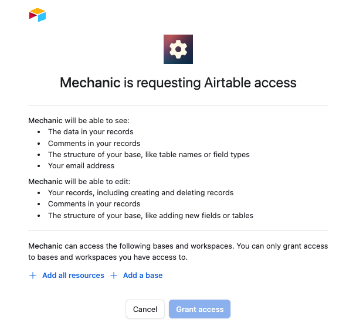

# Event filters

An **event filter** is a Liquid template that evaluates incoming events before they reach your tasks. If the template's output equals the string "false", the event is skipped—no tasks will run for that [event](../../core/events/). Any other output (including empty output) allows the event to proceed normally.

Event filters have access to `event.topic`, `event.data` (the raw webhook payload), and `shop` variables. They're commonly used during bulk operations or data migrations to prevent unnecessary task runs. For example, if you're bulk-updating thousands of customers and have tasks subscribed to `shopify/customers/update`, you can use a filter to skip those update events during the migration period.


Event filters should not be confused with [Liquid filters](../liquid/basics/filters.md).


## Configuration

Event filters are configured in an account's Mechanic settings.

An event filter has two parts:

* Name – any descriptive string
* Template – a Liquid template that renders `false` for events that should be ignored

<figure><figcaption></figcaption></figure>

## Operation

When an event is received, Mechanic begins by running any event filters that are present on a store's Mechanic account. (Order is not guaranteed.) Mechanic renders each event filter template, providing the `event` and `shop` variables. If an event filter's output equals the string "false", Mechanic halts processing of that event entirely—no tasks are run. Any other output (including empty output) allows the event to continue to tasks subscribing to the event's topic.

An event that _wasn't_ processed will look something like this, in the Mechanic frontend:

This feature is useful if a Mechanic account is experiencing (or will experience) a large volume of events that (a) don't need to be processed at all, (b) would slow down your account if they _were_ processed ([learn more about concurrency](../../core/runs/concurrency.md)), and (c) can be programmatically identified.

You can add, update, and remove event filters at any time. Any changes go into effect immediately.
