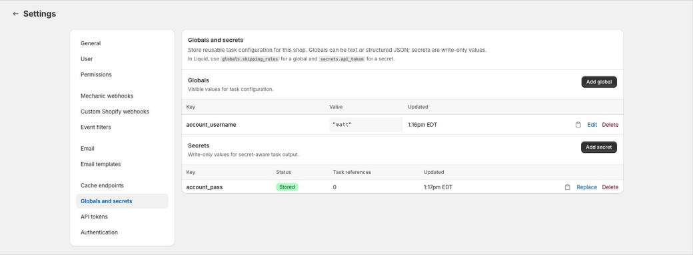

# Globals and secrets

Globals and secrets are shop-level values that tasks can reuse.

Use **globals** for visible configuration, like usernames, warehouse IDs, thresholds, shipping rules, or shared JSON settings. Use **secrets** for sensitive strings, like API tokens, passwords, signing keys, and private keys.

<figure><figcaption></figcaption></figure>

## Globals vs secrets

| Feature | Globals | Secrets |
| --- | --- | --- |
| Stored value | Any JSON value | String only |
| Visible after saving | Yes | No |
| Available in task repos and CLI sync | Yes, in `mechanic.globals.json` | No secrets file is created |
| Liquid access | `globals.some_key` | `secrets.some_key` |
| Missing key behavior | Returns `nil` | Returns `nil` |
| Best for | Shared visible config | Credentials and signing material |

Keys use lower snake case, start with a letter, and may contain lowercase letters, numbers, and underscores. For example: `warehouse_id`, `api_token`, `shipping_rules`.

## Managing globals and secrets

In the Mechanic app, open **Settings > Globals and secrets**.

Globals can be created as text or JSON. Text globals are stored as JSON strings, so a value like `matt` is available in Liquid as `"matt"`. JSON globals may also be objects, arrays, numbers, booleans, or `null`.

Secrets are write-only. Mechanic accepts the value when you create or replace a secret, but the saved value is never shown again. To change a secret, replace it with a new value.

Deleting or replacing a global or secret may affect tasks that reference it. The settings page shows an approximate task reference count for secrets to help with cleanup, but it is metadata only. Review task code before relying on it as a complete dependency map.

## Using globals in Liquid

Globals are available through the `globals` Liquid object.

```liquid
{{ globals.account_username }}
```

If a global stores structured JSON, use it like any other Liquid object:

```liquid

  {{ region }}

```

Missing globals return `nil`.

## Using secrets in Liquid

Secrets are available through the `secrets` Liquid object.

```liquid
{{ secrets.api_token }}
```

This does not return the raw secret value during normal Liquid rendering. If the secret exists, it returns an opaque secret reference. Mechanic turns that reference into the real value only inside supported actions and signing filters, at the moment the value is needed. Echoing it, logging it, or passing it to actions that do not support shop secrets shows the placeholder, not the secret.

Missing secrets return `nil`, so guards like `` work as expected.

For this release, task authors should use secrets only with these supported actions and filters:

* HTTP actions, where secret references in action options are resolved immediately before sending the request.
* FTP actions, for the connection fields `host`, `user`, `password`, `private_key`, `private_key_pem`, and `known_hosts`.
* Signing filters that accept secret material: `hmac_sha1`, `hmac_sha256`, `hmac_sha512`, `rsa_sha256`, and `rsa_sha512`.

Built-in integrations such as Google Drive, Google Sheets, Slack, Airtable, Flow, and Shopify do not use shop secrets as connection credentials in this release. Echo, Email, Files, Event, Cache, and FTP upload/download content also do not receive raw secret values. They keep secret references as placeholders until support is added for those places.

When a supported action resolves a secret, Mechanic redacts the raw value before storing or showing action data, errors, logs, previews, or encoded response fields. For secret-bearing actions, base64 diagnostic fields such as `body_base64` or `data_base64` may be replaced with `__mechanic_secret_value_redacted__`.

## Using globals and secrets in task options

Task options can ask a merchant to select one existing global or secret from the shop.

```liquid
{{ options.shared_username__global_required }}
{{ options.api_token__secret_required }}
```

A `global` option renders a dropdown of shop globals. At runtime, the option returns the selected global's value.

A `secret` option renders a dropdown of shop secrets. At runtime, the option returns the same opaque secret reference as `secrets.api_token`. The raw value is only used by supported actions and signing filters.

Secret options can be combined with `required`, in any order:

```liquid
{{ options.api_token__secret_required }}
{{ options.api_token__required_secret }}
```

Secret options cannot be combined with `userform`. For example, `options.api_token__secret_userform` is invalid.

Task options only select existing globals or secrets. Create and replace values from **Settings > Globals and secrets**, or from the CLI.

## Using globals and secrets with the CLI

Globals can be synced to a repo-safe file:

```bash
mechanic globals pull
```

This writes `mechanic.globals.json`, which may be committed to Git. Push local global values back to the shop with:

```bash
mechanic globals push --dry-run
mechanic globals push --force
```

Secrets are managed by metadata and explicit writes. The CLI never creates a secrets file, and secret values are never printed.

```bash
mechanic secrets list
mechanic secrets set api_token --value-env API_TOKEN
printf %s "$API_TOKEN" | mechanic secrets set api_token --from-stdin --force
```

See [Local task development with the Mechanic CLI](mechanic-cli.md) for command details.

## API tokens

Mechanic API tokens can manage globals and secrets through the public v1 API. Treat API tokens as full-shop credentials: a token can read globals, set or delete globals, list secret metadata, and set, replace, or delete secrets for the shop.

See [API tokens and task sync API](mechanic-task-sync-api.md).

## Related

* [Settings](../app/settings.md#globals-and-secrets)
* [Task options](../core/tasks/options/)
* [Globals object](liquid/objects/globals.md)
* [Secrets object](liquid/objects/secrets.md)
* [HTTP action](../core/actions/http.md)
* [FTP action](../core/actions/ftp.md)
