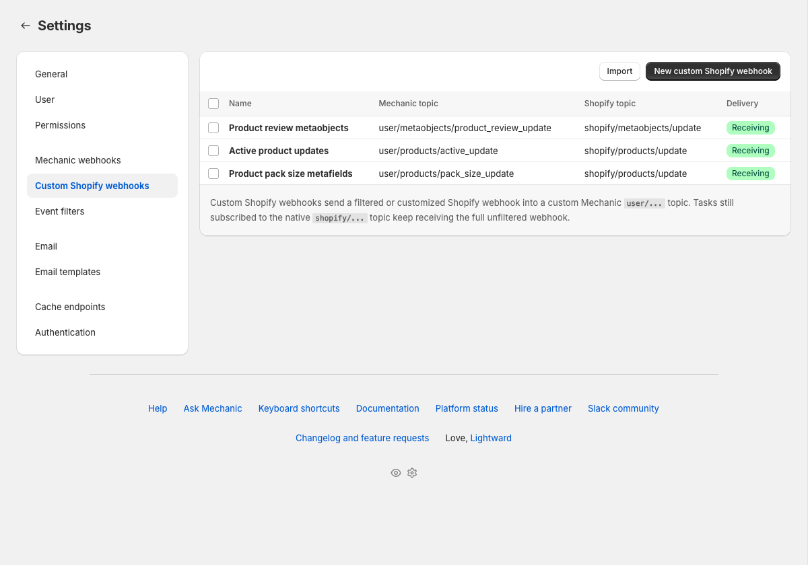
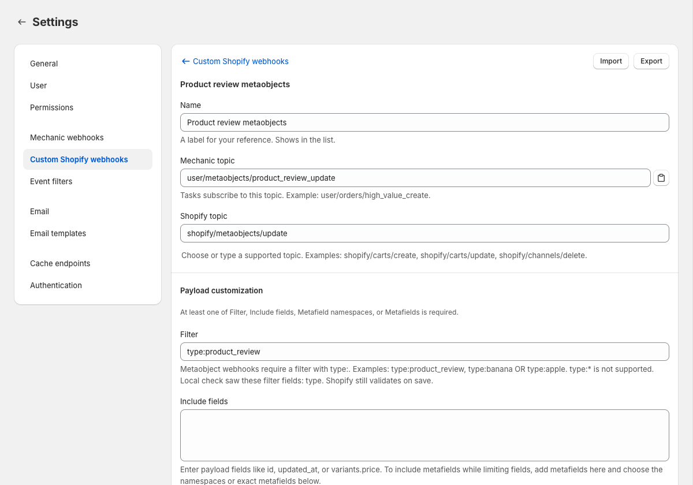
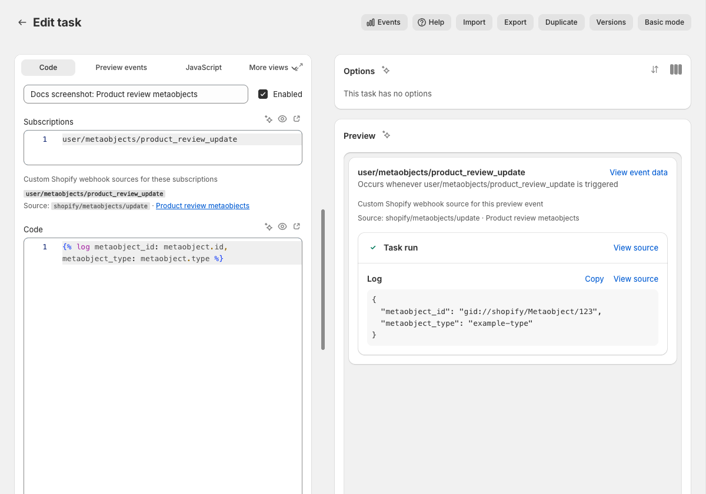

# Custom Shopify webhooks

Custom Shopify webhooks let Mechanic receive Shopify webhook deliveries with Shopify-side filters, customized payload fields, metafields, and metaobject events. They are an advanced Shopify event option.

Use them when you want Shopify to filter webhook deliveries, send a smaller payload, include metafields in the webhook payload, or deliver **metaobject** webhook events. Mechanic receives matching deliveries and turns them into custom `user/...` events, which your tasks subscribe to like any other event topic.


Custom Shopify webhooks are an advanced tool. Most Shopify-triggered tasks should use regular `shopify/...` subscriptions. Reach for a custom Shopify webhook when the Shopify-side behavior matters before the event reaches Mechanic.


## At a glance

| Question | Answer |
|---|---|
| Should most tasks use this? | No. Most Shopify-triggered tasks should use native `shopify/...` subscriptions. |
| What does a task subscribe to? | The custom Mechanic topic, like `user/products/active_update`. |
| Where is the original Shopify topic? | `event.shopify_topic`, like `shopify/products/update`. |
| What is in `event.data`? | The Shopify webhook payload after Shopify applies the filter and payload customization. |
| Can this receive metaobject webhooks? | Yes, for `shopify/metaobjects/create`, `shopify/metaobjects/update`, and `shopify/metaobjects/delete`, with an explicit `type:` filter. |

## Can Mechanic receive Shopify metaobject webhooks?

Yes. Native `shopify/...` task subscriptions do not include metaobject topics, but custom Shopify webhooks can receive:

* `shopify/metaobjects/create`
* `shopify/metaobjects/update`
* `shopify/metaobjects/delete`

Each metaobject webhook needs a concrete `type:` filter, like `type:product_review`.

## What are custom Shopify webhooks?

A custom Shopify webhook connects one Shopify webhook topic to one Mechanic topic:

```text
Shopify topic:  shopify/products/update
Mechanic topic: user/products/active_update
Filter:         status:active
```

When Shopify sends a matching `products/update` webhook, Mechanic creates an event on `user/products/active_update`. Your task subscribes to `user/products/active_update`, not `shopify/products/update`.

## How does routing work?

A custom Shopify webhook has two topics:

* **Shopify topic** — the source Shopify webhook, like `shopify/products/update`.
* **Mechanic topic** — the custom `user/...` topic Mechanic creates for matching deliveries, like `user/products/active_update`.

Tasks subscribe to the Mechanic topic. In Liquid, `event.topic` is the Mechanic topic, and `event.shopify_topic` keeps the source Shopify topic.

## Choose the right webhook

| Use this | When |
|---|---|
| Native Shopify subscription | A task should respond to every delivery for a supported native `shopify/...` topic. |
| Custom Shopify webhook | Advanced: Shopify should filter delivery, customize the payload, include metafields, or send metaobject events. |
| [Mechanic webhook](../webhooks.md) | Something outside Shopify should send an HTTP POST directly to Mechanic. |

Custom Shopify webhooks are still Shopify webhooks. They are different from Mechanic webhooks, which are public inbound URLs for external systems like forms, ERPs, CRMs, and fulfillment services.

If your task only needs the normal Shopify webhook payload for a supported `shopify/...` topic, use a native Shopify subscription instead.

## When should I use custom Shopify webhooks?

Use a custom Shopify webhook when the task needs Shopify to do something before delivery:

* send only matching resources, like active products
* deliver a smaller payload with **Include fields**
* filter by, or include, specific metafields
* receive Shopify metaobject webhooks

If the task can receive the normal Shopify webhook and decide what to do in Liquid, use a regular `shopify/...` subscription.

## How do I create a custom Shopify webhook?

Open **Settings**, choose **Custom Shopify webhooks**, and click **New custom Shopify webhook**.

<figure><figcaption></figcaption></figure>

Fill in:

* **Name** — a label for your reference.
* **Mechanic topic** — the `user/...` topic your tasks will subscribe to, e.g. `user/products/active_update`. Use two parts after `user/`, with lowercase letters, numbers, and underscores.
* **Shopify topic** — the Shopify webhook topic, e.g. `shopify/products/update`. The picker in Settings is the source of truth for supported topics.
* **Payload customization area** — at least one of **Filter**, **Include fields**, **Metafield namespaces**, or **Metafields**. Filter controls whether Shopify delivers the webhook; the other fields control the payload Shopify sends.

<figure><figcaption></figcaption></figure>

After saving, create or update a task so it subscribes to the Mechanic topic. Until an enabled task subscribes, the webhook may be enabled but **Not receiving**.

```text
user/products/active_update
```

Subscription offsets work too:

```text
user/products/active_update+1.hour
```

In the task editor, Mechanic shows when a `user/...` subscription is backed by a custom Shopify webhook. It also warns about inactive or unknown custom webhook topics, and about native `shopify/...` subscriptions that would conflict with an enabled unfiltered custom webhook.

<figure><figcaption></figcaption></figure>

## Which Shopify webhook topics can I use?

Use the **Shopify topic** picker in Settings for the current supported list. It includes supported Shopify webhook topics plus the metaobject topics listed above.

The [Event topics](../events/topics.md#shopify) reference lists native `shopify/...` task subscriptions. Custom Shopify webhooks are configured separately, and they deliver onto `user/...` topics.

## How do I filter Shopify webhooks in Mechanic?

Add a Shopify webhook filter to the custom webhook. Shopify evaluates the filter as part of the webhook subscription before Mechanic receives the delivery.

Examples:

```text
status:active
status:active AND tags:VIP
vendor:"Nike Inc"
variants.price:>=10.00
line_items.properties.name:_gift_message
metafields.namespace:custom AND metafields.key:track_with_mechanic AND metafields.value:true
```

Filters use Shopify's webhook filter syntax. Nested fields use dots, boolean operators like `AND`, `OR`, and `NOT` are supported, and values with spaces should be quoted. For arrays of objects, Shopify matches when at least one nested object satisfies the filter.


Shopify webhook filters are not exactly the same as Shopify Admin search queries. In webhook filters, `:` is the equality operator.

Some money fields need to be filtered as the string value Shopify sends in the webhook payload. For exact matches, quote the decimal string:

```text
total_price:"0.00"
variants.price:"0.00"
```

Do not assume a numeric-looking webhook payload field can be matched without quotes. For range filters, Shopify's examples use numeric comparisons like `variants.price:>=10.00`. This is Shopify webhook filter behavior, not a Mechanic limitation.



Shopify filters are state filters, not "changed field" filters. A `products/update` filter like `variants.price:>=10.00` means the product currently has a variant at that price or higher. It does not mean the variant price changed in this update.


### When a filter does not behave as expected

Shopify filter problems do not all fail the same way:

* Incorrect syntax is usually rejected when you save.
* A field path that does not exist for that Shopify topic can save, but never match.
* A value compared with the wrong type, like an unquoted exact money value, can save, but never match.
* A field used in **Filter** but missing from **Include fields**, when **Include fields** is set, should be rejected when you save.
* A metafield used in **Filter** but missing from **Metafield namespaces** or **Metafields** should be rejected when you save.
* A matching update that only changed fields outside **Include fields** may be debounced if the trimmed payload would be the same as a recent delivery.

When troubleshooting, inspect a real Shopify webhook payload for the topic, then build the filter from fields that are present in that payload. For tags on topics like products and orders, treat the tag list as string-like: filter for the tag keyword Shopify sends, and test with a real event.

### Filtering by metafields

To filter by metafield data, select the metafield in **Metafield namespaces** or **Metafields**, then use `metafields.namespace`, `metafields.key`, and `metafields.value` in the filter:

```text
metafields.namespace:custom AND metafields.key:track_with_mechanic AND metafields.value:true
```

For a value that only needs to exist:

```text
metafields.namespace:custom AND metafields.key:track_with_mechanic AND metafields.value:*
```

For variant metafields on a product webhook, prefix the metafield path with `variants.`:

```text
variants.metafields.namespace:custom AND variants.metafields.key:hide_from_storefront AND variants.metafields.value:true
```

Metafield filters use Shopify webhook filter syntax, not Shopify Admin search syntax. For example, use `metafields.namespace:custom AND metafields.key:track_with_mechanic`; do not use a GraphQL search query shape like `metafields.custom.track_with_mechanic:true`.

Mechanic runs a local preflight check for common filter mistakes, then Shopify validates the subscription on save. If you also set **Include fields**, include every field your filter references. For example, a filter using `variants.price` needs `variants` or `variants.price` in **Include fields**. For metafield filters, choose the namespace or exact metafield in **Metafield namespaces** or **Metafields**. If **Include fields** is set, include `metafields` too.

For Shopify's full syntax and edge cases, see [Filter your events](https://shopify.dev/docs/apps/build/webhooks/customize/filters).

## How do I receive Shopify metaobject webhooks in Mechanic?

Create a custom Shopify webhook using one of these Shopify topics:

* `shopify/metaobjects/create`
* `shopify/metaobjects/update`
* `shopify/metaobjects/delete`

Metaobject webhooks require a `type:` filter. Shopify does not support `type:*`, so list the exact metaobject definition type you want.

```text
type:product_review
```

To listen for more than one type:

```text
type:product_review OR type:faq_entry
```

Example configuration:

```text
Name:           Product review updates
Shopify topic:  shopify/metaobjects/update
Mechanic topic: user/metaobjects/product_review_update
Filter:         type:product_review
```

Task subscription:

```text
user/metaobjects/product_review_update
```

Task code:

```liquid

```

Native Mechanic `shopify/...` subscriptions do not include metaobject topics. Use custom Shopify webhooks for metaobjects. If the webhook shows **Needs permissions**, open **Settings → Permissions** and grant the required metaobject scope.

## How do I customize a Shopify webhook payload?

Use the payload customization fields:

* **Include fields** — sends only specific payload fields, such as `id`, `updated_at`, or `variants.price`.
* **Metafield namespaces** — includes all metafields in a namespace, such as `custom`.
* **Metafields** — includes exact metafields, such as `custom.pack_size`.


Payload customization does not make a webhook unique.

Shopify only distinguishes subscriptions by Shopify topic and filter for Mechanic's app and destination. The **Name**, **Mechanic topic**, **Include fields**, **Metafield namespaces**, and **Metafields** can all differ, and Shopify will still reject the second enabled webhook if the Shopify topic and filter are the same.

If you export/import a webhook to make a variant, change the **Filter** too. If the variants need the same delivery set, use one custom Shopify webhook and branch inside the subscribed task.


When **Include fields** is blank, Shopify sends the normal payload shape. When **Include fields** has values, Shopify sends only those fields.

For update topics, include `updated_at` when you want every matching update to arrive. Shopify may skip repeated deliveries when **Include fields** produces the same trimmed payload as a recent delivery. Leave `updated_at` out when you intentionally want Shopify to reduce repeat deliveries where only fields outside your payload changed.

For Shopify's payload rules, see [Modify your payloads](https://shopify.dev/docs/apps/build/webhooks/customize/modify-payloads).

### The metafields gotchas

`include_fields` is not a metafield selector. This will not include the `custom.pack_size` metafield:

```text
Include fields:
custom.pack_size
```

Use **Metafields** for exact metafields:

```text
Metafields:
custom.pack_size
```


Metafields can also be used in filters. Select the namespace or exact metafield here, then filter with fields like `metafields.namespace`, `metafields.key`, and `metafields.value`.


If you are also using **Include fields**, add `metafields` there too:

```text
Include fields:
id
title
metafields

Metafields:
custom.pack_size
```

## Recipes

### Active product updates

Use this when a task only cares about active products.

```text
Name:           Active product updates
Shopify topic:  shopify/products/update
Mechanic topic: user/products/active_update
Filter:         status:active
Include fields:
  id
  title
  status
  updated_at
```

Task subscription:

```text
user/products/active_update
```

Task code:

```liquid

```

### Product updates with a smaller variant payload

Use this when the task only needs variant IDs and prices.

```text
Name:           Product variant price updates
Shopify topic:  shopify/products/update
Mechanic topic: user/products/variant_price_update
Filter:         variants.price:>=10.00
Include fields:
  id
  variants.id
  variants.price
  updated_at
```

Remember: this filter means the product has at least one variant priced at or above 10.00. It does not prove the price changed in this specific update.

### Product updates filtered by a metafield

Use this when only products with a known metafield should reach the task.

```text
Name:           Products tracked by Mechanic
Shopify topic:  shopify/products/update
Mechanic topic: user/products/tracked_update
Filter:         metafields.namespace:custom AND metafields.key:track_with_mechanic AND metafields.value:true
Include fields:
  id
  title
  updated_at
  metafields
Metafields:
  custom.track_with_mechanic
```

Task code:

```liquid



  
    
  



```

This is a state filter. The task receives product updates while the metafield has this value; the filter does not prove the metafield changed in that update.

## What the task receives

For a custom Shopify webhook event:

* `event.topic` is the custom Mechanic topic, e.g. `user/products/active_update`.
* `event.shopify_topic` is the source Shopify topic, e.g. `shopify/products/update`.
* `event.data` is the Shopify webhook payload after filtering and payload customization.
* `event.source` is `custom_shopify_webhook_subscription:<uuid>`.

Mechanic also builds the usual Shopify subject variable from the source Shopify topic. A custom `shopify/products/update` webhook provides `product`, `shopify/orders/create` provides `order`, and `shopify/metaobjects/update` provides `metaobject`. These variables start with the payload Shopify delivered, so **Include fields** and metafield settings affect what is immediately present.

For native Shopify deliveries, `event.topic` and `event.shopify_topic` are the same. For non-Shopify events, `event.shopify_topic` is blank.

## Delivery statuses

| Status | What it means |
|---|---|
| **Draft** | The custom Shopify webhook has not been saved yet. |
| **Receiving** | It is enabled, synced with Shopify, and at least one enabled task subscribes to its Mechanic topic. |
| **Not receiving** | It is enabled, but no enabled task subscribes to its Mechanic topic yet. |
| **Needs permissions** | Mechanic needs additional Shopify permissions before Shopify can activate the subscription. |
| **Needs filter** | The webhook has no filter and conflicts with a native `shopify/...` task subscription for the same Shopify topic. |
| **Sync error** | Shopify rejected the last sync attempt, or cleanup failed. Read the inline error and adjust the configuration. |
| **Disabled** | Mechanic keeps the configuration, but does not keep a matching Shopify subscription active. |

## Common issues and gotchas

**Tasks subscribe to the Mechanic topic.** If the webhook sends to `user/products/active_update`, the task must subscribe to `user/products/active_update`. Subscribing to `shopify/products/update` still means native, unfiltered delivery.

**Enabled does not always mean receiving.** A custom Shopify webhook is only kept active in Shopify while at least one enabled task subscribes to its Mechanic topic.

**Blank filters can conflict with native subscriptions.** Shopify cannot keep an unfiltered native subscription and an unfiltered custom subscription for the same app, destination, and topic. This includes native task subscriptions and Shopify webhooks Mechanic keeps for platform behavior. Add a real filter, or use `id:*` when you need every delivery. For metaobjects, use a concrete `type:` filter instead.

**Some money fields behave like strings.** Shopify webhook payloads often represent prices and totals as strings, like `"0.00"`. For exact money matches, quote the decimal string in the Shopify filter, e.g. `total_price:"0.00"` or `variants.price:"0.00"`. Test against a real Shopify event when exact field typing matters.

**Filter problems fail in different ways.** Shopify usually rejects incorrect syntax and filters whose fields are missing from **Include fields**, **Metafield namespaces**, or **Metafields**. Shopify may accept a filter that references a field path the topic never sends, or that compares a field with the wrong value type, but then send no matching webhooks. If a custom webhook is enabled but never receives, test the filter against a real Shopify event payload.

**Include fields can affect repeat update deliveries.** **Include fields** is not a "fire only when these fields change" switch, but Shopify may skip a recent update delivery when the payload after trimming would be identical. Include `updated_at` when you want every matching update to arrive. Leave it out when you intentionally want Shopify to reduce repeat deliveries where only fields outside your payload changed.

**Payload customization does not make a webhook unique.** Shopify only allows one enabled webhook for the same app, destination, Shopify topic, and filter. Two custom Shopify webhooks with the same topic and filter still conflict even if the **Name**, **Mechanic topic**, **Include fields**, **Metafield namespaces**, or **Metafields** are different. This is a Shopify limitation, and it often appears after duplicating a webhook with import/export.

**Two webhooks can share one Mechanic topic.** This is allowed, but tasks subscribed to that topic will receive deliveries from both webhooks. Use `event.shopify_topic` and `event.source` if the task needs to tell them apart.

**Preview mode is not an end-to-end webhook test.** Task preview runs Liquid against preview data. To confirm a Shopify filter or payload shape, save the custom webhook and trigger a real matching event in Shopify.

**Manage these in Mechanic.** Custom Shopify webhooks are owned by Mechanic's sync process. Create, edit, disable, and delete them from **Settings → Custom Shopify webhooks**.

**Do not look for them in Shopify Admin's webhook list.** Mechanic's custom Shopify webhooks are EventBridge-backed app subscriptions. Use the delivery status in Mechanic to confirm whether a webhook is receiving.

## Why isn't my custom Shopify webhook receiving?

Check these first:

1. Is at least one enabled task subscribed to the custom Mechanic topic?
2. Does the webhook show **Needs permissions**? If so, open **Settings → Permissions** and grant the missing Shopify scopes.
3. Does the webhook show **Needs filter**? Add a filter, even `id:*` for non-metaobject topics.
4. Does the task subscribe to the `user/...` topic exactly?
5. Did you trigger a real Shopify event that matches the filter?
6. Does the filter use fields that exist for that Shopify topic, with the value types Shopify sends?
7. If **Include fields** is set, would the trimmed payload differ from a recent delivery, or did you include `updated_at`?

Open the resulting event in Mechanic and check `event.data`, `event.topic`, and `event.shopify_topic`. The event detail page also shows the custom Shopify webhook source when Mechanic knows which webhook delivered it.

## Import and export

Custom Shopify webhooks can be imported and exported from the custom Shopify webhooks settings area.

Exports include configuration only: `name`, `shopify_topic`, `event_topic`, `filter`, `include_fields`, `metafield_namespaces`, and `metafields`. They do not include enabled state, Shopify subscription IDs, sync status, subscriber counts, or delivery status.

List imports are created disabled for review. Imports into an existing webhook keep that webhook's current enabled or disabled state.

If an imported webhook is a variant of an existing webhook, give it a different **Filter** before enabling it. Changing only payload customization is not enough for Shopify to treat it as a separate subscription.

## Related

* [How Shopify events reach Mechanic](../../core/shopify/events/README.md)
* [Event topics](../events/topics.md)
* [Subscriptions](../../core/tasks/subscriptions.md)
* [Permissions](../../core/tasks/permissions.md)
* [Event object](../liquid/objects/event.md)
* [Mechanic webhooks](../webhooks.md)
* [Include metafields in Shopify webhook events](../../techniques/include-metafields-in-shopify-webhook-events.md)
* [Subscribe to Shopify metaobject events](../../techniques/subscribe-to-shopify-metaobject-events.md)
* Shopify: [Filter your events](https://shopify.dev/docs/apps/build/webhooks/customize/filters)
* Shopify: [Modify your payloads](https://shopify.dev/docs/apps/build/webhooks/customize/modify-payloads)
* Shopify: [WebhookSubscriptionInput](https://shopify.dev/docs/api/admin-graphql/latest/input-objects/WebhookSubscriptionInput)
