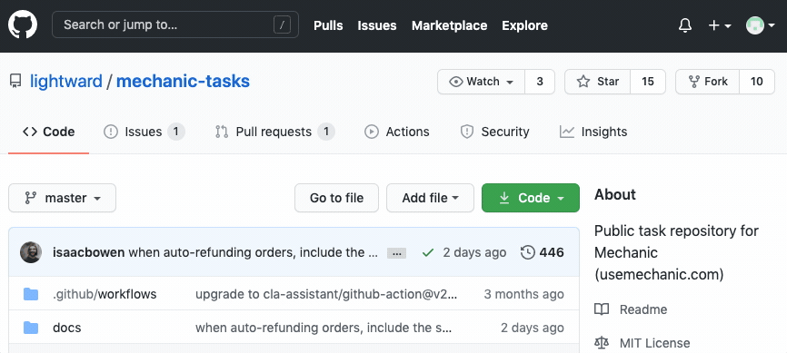

# Contributing

Mechanic's [**task library**](./) is a central resource for the entire community, and is continually enriched through **contributions**, via pull requests [on GitHub](https://github.com/lightward/mechanic-tasks).

## Contributing your work to the task library

You've created a custom task, and you want to share it with the world! This brings us so much joy, and this is what the Mechanic project and this community are all about. If you get stuck along the way, please hop onto the [Slack workspace](https://join.slack.com/t/usemechanic/shared\_invite/zt-cq84nrs7-ggYbYTbf\~CrCjTg8nmHP2A), and we'll be glad to help.


The task library is hosted in a Git repository on GitHub. You'll make your contribution via a [Pull Request](https://docs.github.com/en/github/collaborating-with-issues-and-pull-requests/about-pull-requests).


We follow the same process any open-source project does when it comes to code management and code contributions. One bonus of contributing to the Mechanic task library is that once you learn the process here, you'll know how to contribute to open-source projects going forward.

### The process

* You'll [fork](https://docs.github.com/en/github/getting-started-with-github/fork-a-repo) the task library [repository](https://github.com/lightward/mechanic-tasks).
  * Forking means taking a copy of our repository, so that you can make your changes and additions.
* Make your changes in your forked repository.
* Make a [pull request](https://docs.github.com/en/github/collaborating-with-issues-and-pull-requests/about-pull-requests), which will trigger a review of your proposed changes and the merging of them into the main repository, making your task available to everyone using the app.

### Step-by-step instructions

1. You'll need a GitHub account, you can signup for one [here](https://github.com/join).&#x20;
2.  Visit the [task library repository](https://github.com/lightward/mechanic-tasks) and fork it as shown below. You'll make your changes to this copy of the repository.

    
3.  The task library is made up of the [tasks](https://github.com/lightward/mechanic-tasks/tree/master/tasks) and the supporting documentation. In these next few steps, you'll ensure you can build the [docs](https://github.com/lightward/mechanic-tasks/tree/master/docs), so that you can complete this step when you are ready to submit your contribution.

    1. Building the docs requires nodejs and npm. You can install them from here: [https://www.npmjs.com/get-npm](https://www.npmjs.com/get-npm)
    2. While in the project directory, run the following commands to build the docs:

    ```
    npm install   # install dependencies
    npm run build # compile docs
    npm run test  # apply sanity checks
    ```
4. Now that you can build the docs you are ready to [contribute](https://github.com/lightward/mechanic-tasks/blob/master/CONTRIBUTING.md)!
5. Your task documentation, options, subscriptions, code, are done in Mechanic. If you choose to use an external editor that's great, you still need to transfer it into Mechanic, so that you can export the task in the JSON format you need for the library. Importing/Exporting tasks from Mechanic is covered [here](../../core/tasks/import-and-export.md).
6. If you're changing an existing task you [export](https://github.com/lightward/mechanic-tasks/blob/master/CONTRIBUTING.md) the JSON, and replace the contents of the `task/task_file_name.json` and then run the commands `npm run build` and `npm run test.`
7.  If you are contributing a new task, you'll [export](../../core/tasks/import-and-export.md) the JSON from Mechanic, and save the JSON file in the `tasks/directory` of your forked repository, named with an appropriate handle for the task. (For example, a task named "Hide out-of-stock products" should have its JSON export stored in `"tasks/hide-out-of-stock-products.json"`.) And, then you'll execute the commands:

    `npm run build` and `npm run test`.
8. If all goes well with the build, you'll see your task listed in the automatically created documentation in `docs/README.md`
9. You're now ready to make your pull request! Head over to [https://github.com/lightward/mechanic-tasks/pulls](https://github.com/lightward/mechanic-tasks/pulls)  and click New pull request, you should see the changes you committed to your fork, and you'll proceed with filling out the pull request form.
10. After you submit your first pull request, you will be required to read and accept [our CLA](https://github.com/lightward/mechanic-tasks/blob/master/CLA.md). The[ CLA assistant](https://github.com/marketplace/actions/cla-assistant-lite) will leave a comment, giving you a statement of agreement that you must paste into a comment of your own.
11. This process could sound confusing if you haven't done it before, but once you've done it once, it's simple and it is also pretty exciting to go through the process.  The other bonus is, you'll be ready to submit a pull request to any open-source software project in the future. If you need help please out to us in the [community Slack workspace](https://slack.mechanic.dev/).
