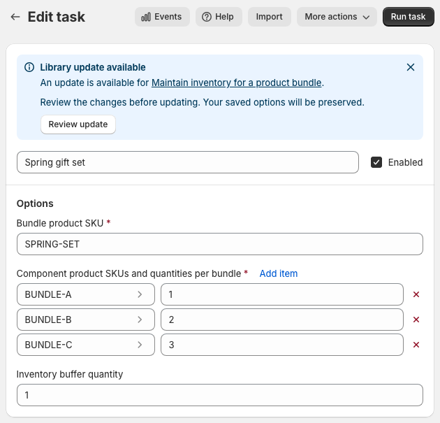
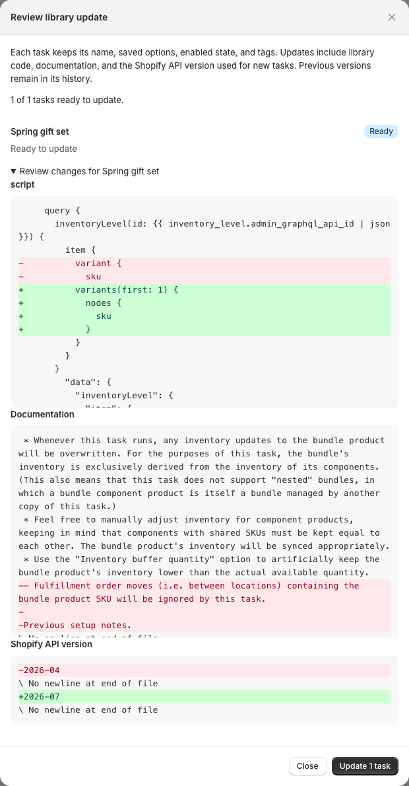
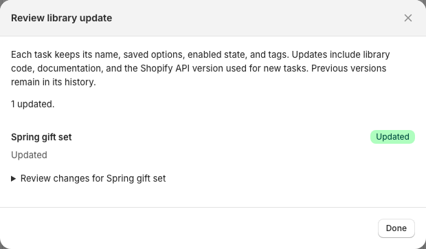
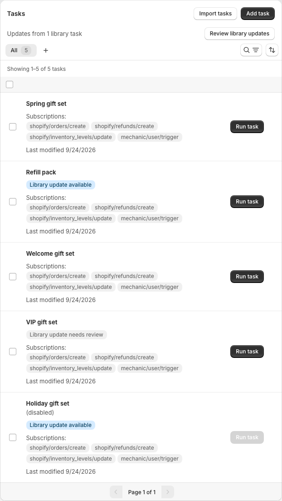
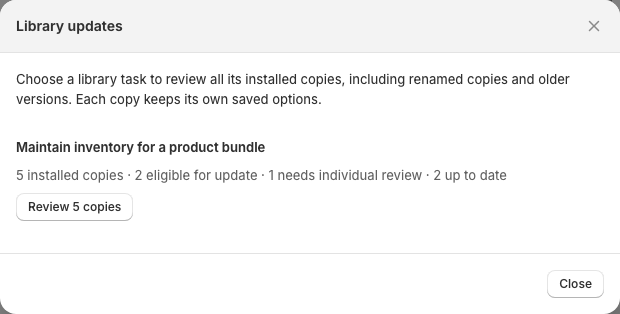
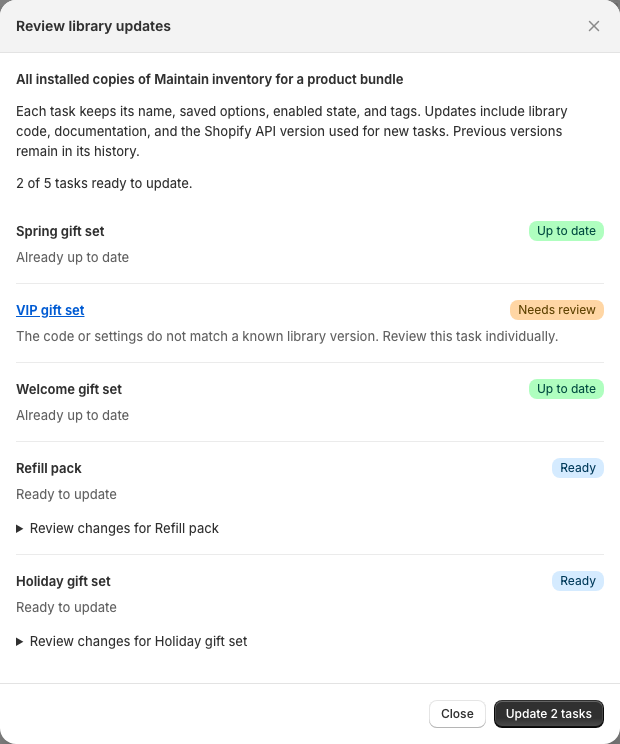
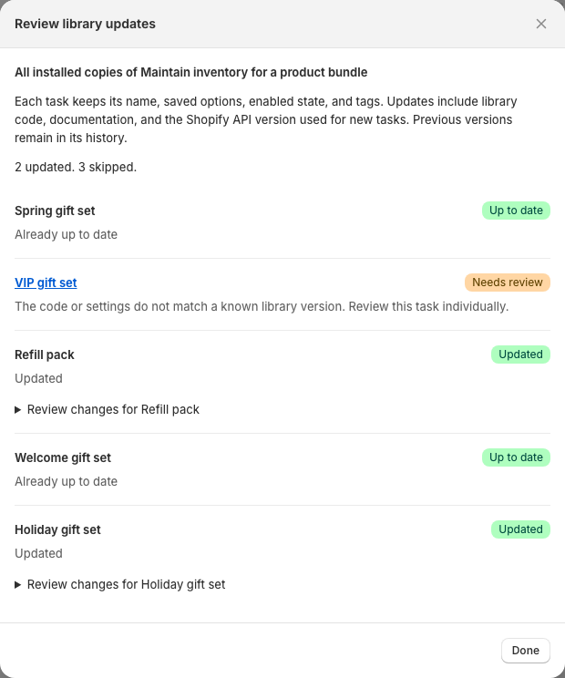
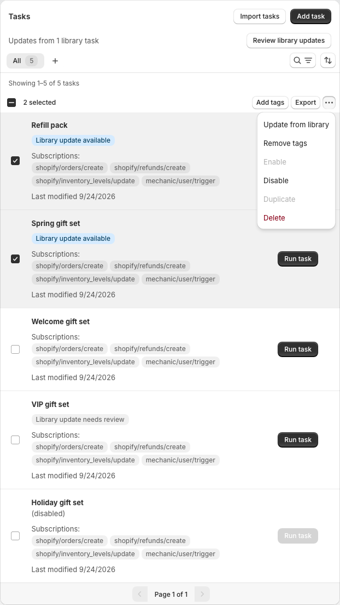
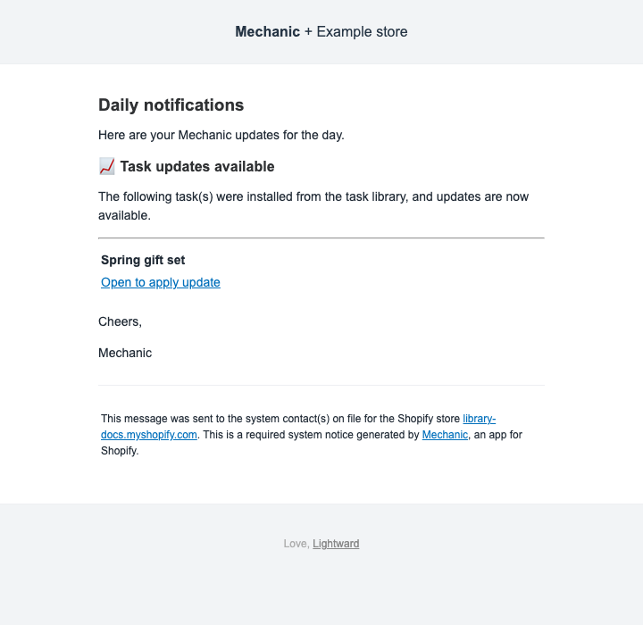

# Updating library tasks

When you install a task from the [task library](README.md), you get your own copy. Later library changes aren't applied to that copy automatically. You can review an available update in Mechanic and choose when to apply it.

You can update one task, all installed copies of a particular library task, or a selection from your task list. Mechanic checks each copy before updating it.

The screenshots below use an example store with several copies of **Maintain inventory for a product bundle**.

## What an update changes and preserves

Each copy keeps its name, saved option values, enabled or disabled state, and tags. Its previous code, documentation, and settings remain in its version history.

The update replaces the library's code, documentation, and related execution settings, such as subscriptions, JavaScript, sequencing settings, and preview definitions. It also sets the Shopify API version to the version Mechanic uses for newly installed tasks, so the updated code is previewed and saved using that version. Documentation and API version changes appear in the review alongside code changes.

Mechanic offers this update only when your copy's code and execution settings match a known library version and the new version uses the same option fields. An update can also be available when the code is already current but the documentation or API version differs.

If you've added your own notes to the task's documentation, review the documentation changes before updating. The update replaces those notes with the library's documentation; the previous documentation remains in version history.

Changing option values or renaming a task doesn't by itself prevent an update. For example, if you have a separate copy of **Maintain inventory for a product bundle** for each bundle, each eligible copy keeps its own bundle settings when updated.

Changes you've made to the code or execution settings can require individual attention. Mechanic doesn't automatically merge custom code with library changes.

## Update a single task

1. Open the task in Mechanic. If it shows **Library update available**, click **Review update**. Save or discard any unsaved edits first.

    

2. Expand **Review changes for…** to inspect the differences. Removed lines are red with a minus sign (`-`); added lines are green with a plus sign (`+`). Opening the review doesn't save anything. When you're ready, click **Update 1 task**.

    

3. Check that the result says **Updated**, then click **Done**. The update notice clears from the editor.

    

An available library update doesn't always mean your copy is eligible to apply it. When individual review is needed, the notice explains why instead of offering the update button.

## Update copies of one library task

Use this when you have several copies of the same task, even if you've renamed them or they use different older versions.

1. On Mechanic's home screen, click **Review library updates** above the task list. This appears when linked library tasks have available updates.
2. Find the library task you want to update. Its group shows how many installed copies are eligible, need individual review, or are already up to date.

    

3. Click **Review copies** (the button includes the number of copies). Mechanic checks each copy and shows which are ready.
4. Expand **Review changes for…** beneath a task to inspect the changes. Opening this review doesn't save anything.

    

5. Click **Update N tasks**, where N is the number ready to update. Keep the window open until processing finishes, then check the results for each copy.

    

In this example, **Spring gift set** was updated individually first. The bulk update then updates **Refill pack** and **Holiday gift set**, skips the customized **VIP gift set**, and leaves the two current copies unchanged.

The group includes all copies linked to that library task, including renamed and disabled copies, regardless of the current task-list search. It doesn't group unrelated tasks just because they have the same name. A copy Mechanic hasn't linked to the library won't appear in that group.

Only ready copies are updated. Copies that need individual review are skipped, and disabled copies stay disabled. If no copies are eligible, the group's review button is disabled.

## Update a selection of tasks

Select the tasks using the checkboxes in the task list, then choose **Update from library** from the bulk actions menu. At least one selected task must have an eligible update for this action to be available.

The review works the same way as the library-task group: inspect the changes, apply updates to the ready copies, and check the results. Selected tasks can come from different library tasks.

## When a task needs individual review

Click the title of a task marked **Needs review** in the review window to open that task in a new tab. You can inspect its code and options while keeping the original review open. Any updates already running continue in the original tab.

Mechanic may leave a copy unchanged for several reasons:

* **Code or settings don't match a known library version.** The copy may have been customized, or Mechanic may be unable to recognize its version. This message doesn't necessarily mean you changed it.
* **The update changes the available options.** The new version needs a different set of settings, so it needs individual configuration.
* **Library history is still being checked.** Try again later.
* **The task isn't linked to the library, or the library task is no longer published.** Mechanic can't offer a library update for that copy.
* **The task or library version changed after review.** Close the review and open it again to check the latest version. Reviews also expire after one hour.
* **The preview or permissions check couldn't complete.** Follow the message shown for that task before trying again.

For a library task you haven't customized, [contact support](../../support.md) if you're unsure how to proceed. If you've changed its code, work with its author or see [Get help with a custom task](../../custom-help.md) to combine your changes with the library update.

## If only some updates finish

One skipped or unsuccessful copy doesn't stop the others from updating. Check the result beside each task.

If a result says the update couldn't be confirmed, use **Retry unconfirmed updates** in the same review window. This checks or finishes the same update. If you closed the window or lost your connection, reopen the review to check the tasks' current state; successfully updated copies will be up to date.

## How you're notified

* **In the task list:** update indicators identify tasks with available updates or copies that need individual review. **Review library updates** lets you browse updates by library task.
* **In the task editor:** a **Library update available** banner links to the library task and offers **Review update** when your copy is eligible. Otherwise, it explains what needs attention.
* **By email:** Mechanic can include eligible task updates in its daily notification email, with links to open the tasks. These emails go to the **System contact email** configured in [Settings](../../app/settings.md), or your store's Shopify email address if no system contact email is set.

Open the task in Mechanic to see its current update status and review the changes. You choose whether and when to apply the update.
