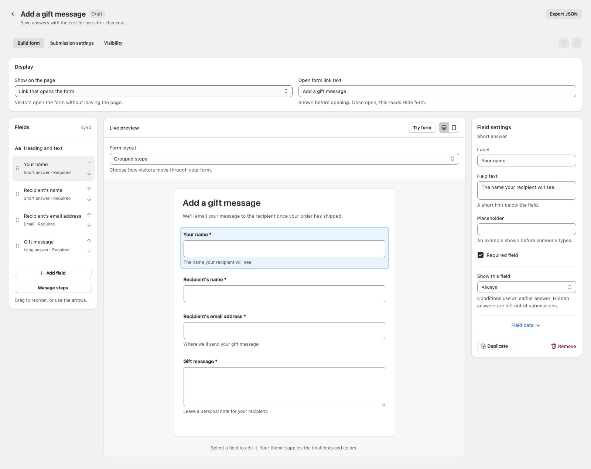

# Add a gift message form to your Shopify theme and email recipients after fulfillment

Let shoppers add a recipient and personal message to their gift order, then send that message when the order has been fulfilled. This tutorial connects a Mechanic form in your Shopify theme with a ready-to-use email task.

You will set up two pieces: the **Add a gift message** form starter on your cart page, and the **Add a gift message form to your Shopify theme and email recipients after fulfillment** task. Adding the task does not automatically install the form in your theme.

**Shopper fills in the gift form → answers save to the cart → checkout carries them onto the order → full fulfillment starts the email task.**

This setup uses one recipient and one message for the whole order. If the order ships in parts, the email waits until the whole order is marked fulfilled in Shopify. It is not a delivery confirmation.

## Before you start

You need [Mechanic installed](https://apps.shopify.com/mechanic), access to edit your theme, and a cart-page section that supports app blocks. Your Mechanic account also needs [approval to send email](../../platform/email/README.md). Have an inbox you control ready for testing.

This tutorial uses the full cart page. A form on that page does not appear inside a cart drawer. In Dawn, **Theme settings → Cart → Cart type → Page** selects the cart-page experience. If you keep a drawer, ask your theme developer to add an **Add a gift message** link to the cart page. That link is a theme customization; Mechanic does not insert it automatically. See [cart drawer guidance](../../app/forms.md#cart-drawers).

## 1. Create the gift form

Open Mechanic, choose **Forms**, then **Create form**. Find **Add a gift message** and choose **Use template**.

The starter has four questions:

- **Your name:** the sender's name.
- **Recipient’s name:** who the gift is for.
- **Recipient’s email address:** where the gift message will be sent.
- **Gift message:** the shopper's personal note.

Change the question labels, introduction, and help text to suit your store. Keep the field data keys unchanged for the matching task: `sender_name`, `recipient_name`, `recipient_email`, and `gift_message`.

<figure><figcaption><p>The starter provides the questions. Edit the wording without changing the field data keys used by the email task.</p></figcaption></figure>

Under **Display**, the starter uses **Link that opens the form**, with **Add a gift message** as its link text. Customers choose this optional link to open the fields inline on the cart page. Shoppers who leave it untouched can check out normally without adding a gift message. Choose **Try form** to check the questions; the builder preview does not change a cart or send email.

The introduction appears beneath the link before the form is opened: “We’ll email your message to the recipient once your order has shipped.” Edit **Introduction** under **Heading and text** to match your store and the task you connect. Opening the form moves this explanation beneath the heading.

## 2. Check automatic cart saving

Open **Submission settings**. The starter selects **Automatically save to the cart** under **Save or send answers**. It does not need a webhook.

Complete answers save automatically after a short pause in typing. There is no separate Save button for the customer. The confirmation appears only after Shopify confirms the save. You can customize it; describe the saved gift details rather than saying an email has already been sent.

<figure><figcaption><p>Save the details with the cart now. The task uses them after checkout and fulfillment.</p></figcaption></figure>

Customers can edit the saved details or choose **Remove answers**. An untouched form stays optional. If they have started editing, normal cart checkout waits for the latest save. Incomplete details or a failed save keep them on the cart page to fix the details, retry, or remove them.

Accelerated payment buttons, Buy it now, and custom checkout behavior may bypass these checks. The form is not a checkout validation rule. Test the routes your store actually uses.

## 3. Publish and add the form to the cart page

Save your form, then choose **Publish form**. Open its **Theme** tab and use **Add to cart page** to open the theme editor. Add a **Mechanic form** block to a section that supports app blocks, select your published gift form in the block's **Form** picker, and save the theme.

Place the form where shoppers will notice it before checkout. The starter's **Visibility** rule hides it while the cart is empty. Add a product when checking its appearance.

Your theme supplies the form's fonts and colors. The theme editor shows a preview; use an actual storefront preview tab to test saving to a real cart. An unpublished theme preview still uses a real cart.

## 4. Add the matching email task

In Mechanic, install [Add a gift message form to your Shopify theme and email recipients after fulfillment](https://tasks.mechanic.dev/add-a-gift-message-form-to-your-shopify-theme-and-email-recipients-after-fulfillment).

In the task's **Form** option, select the published gift form you just created. Leave the field key options at their defaults if you kept the starter's keys. If you changed a key, update its matching task option too.

Customize **Email subject** and **Email body**. The body supports `RECIPIENT_NAME`, `SENDER_NAME`, `GIFT_MESSAGE`, and `SHOP_NAME`; the subject supports all except `GIFT_MESSAGE`. Replies go to your shop's customer email address.

For example, a body could say:

```text
Hi RECIPIENT_NAME,

SENDER_NAME has sent you a gift from SHOP_NAME.

Here is their message:
GIFT_MESSAGE
```

Choose wording that fits your fulfillment process. Shopify marking an order fulfilled does not necessarily mean a carrier has collected or delivered it.

Save and enable the task, and approve its requested Shopify access. It needs order-write access to record that a gift email has been claimed/sent and avoid sending again for repeated fulfillment events. It does not need a form webhook, shared secret, or Mechanic JavaScript embed for this cart-saving flow.

The email goes to the recipient entered in the form, not automatically to the person paying for the order. The task does not include prices, billing details, or the buyer's order-status link.

## 5. Test the complete journey

Use a development store or your normal Shopify test-order process, with a recipient inbox you control.

1. Add a product and open the cart page. Find and open **Add a gift message**.
2. Fill in all four details. Confirm that the saved message appears without clicking Save.
3. Reload the cart and check that the details return. Edit them, then click normal **Checkout** immediately; it should wait for the latest save.
4. Complete a test order. The gift details should be present in the order's additional details/custom attributes. Saving the form and placing the order should not send the gift email yet.
5. Mark the order fully fulfilled. Check the task's event and action results in Mechanic, then confirm the message arrived in your recipient inbox.
6. For a split shipment, confirm that a partial fulfillment sends no gift email and that the final fulfillment sends it.
7. Test **Remove answers**, leaving the form untouched, mobile checkout, and any cart drawer or accelerated checkout route your store offers.

Do not repeatedly retry a successful email action to test duplicates; that can send another email. The task prevents automatic repeat sends by recording a claim for the order and selected form. See the task's recovery instructions if an action fails or its outcome is uncertain.

## Questions you might have

### Can each item have a different recipient?

This starter uses one recipient and message for the whole order. It does not assign gift details to individual line items or send separate messages for partial shipments.

### Where are the gift details stored?

They are Shopify cart attributes, carried onto the order at checkout. The form changes only its own attributes; it leaves the cart note and other apps' attributes alone. These are customer-entered details, not verified identity or marketing consent.

### What if the customer changes their mind?

They can reopen the form and edit the details or choose **Remove answers** before checkout. Emptying the cart alone does not clear its saved attributes. Unpublishing a form also does not erase details already saved to carts or orders.

### What if no email arrives?

Check that the task is enabled, the correct published form is selected, email is approved, and the order is fully fulfilled rather than partially fulfilled or cancelled. Then inspect its event and action results in Mechanic. A failed or uncertain send keeps its duplicate-prevention claim; review the original action before retrying anything.

For more ways to connect your storefront with your automations, see [Storefront forms](../../app/forms.md) and the [task library](https://tasks.mechanic.dev/).
