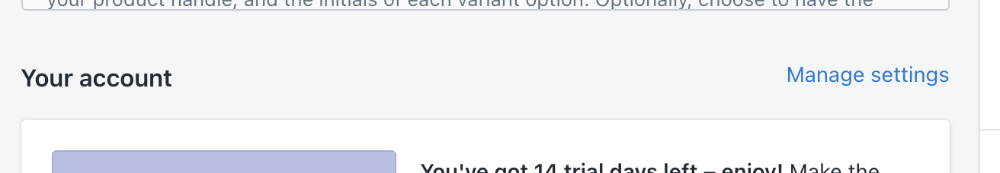
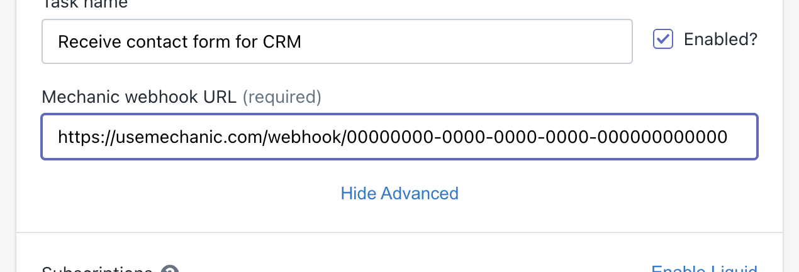
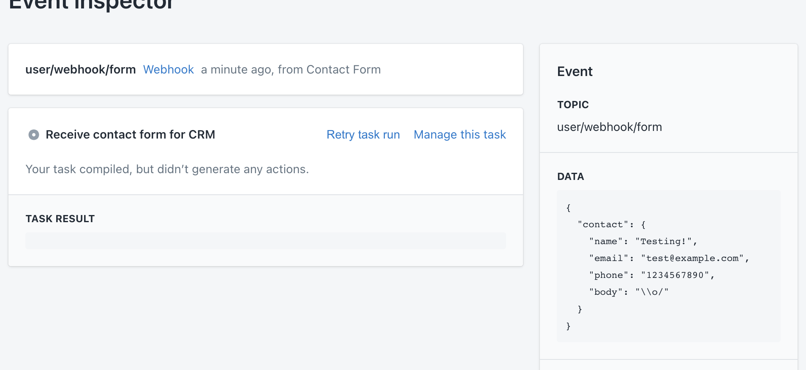
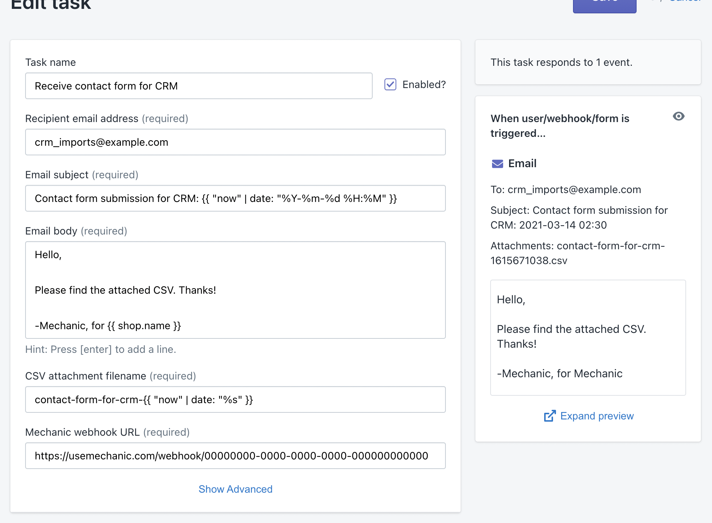

# Triggering tasks from a contact form

This tutorial walks you through setting up a custom task in Mechanic, which is called on Contact Form submission on your Shopify frontend, the contents of the form are passed to the task, which emails the contents in CSV format.

Before beginning this tutorial, here's what you'll need:

* A Shopify store, which has Mechanic installed \(see [Mechanic's app store page](https://apps.shopify.com/mechanic?ref=lightward)\)
* A basic knowledge of Liquid \([need a refresher?](../../platform/liquid/basics/)\)
* A basic knowledge of JavaScript \([need a refresher?](https://www.w3schools.com/js/default.asp)\)

## The situation

We have an online store called Mario's Mushrooms, hosted on Shopify. Business is booming, and our mushrooms are being shipped all over the world. Our CEO, Mario, asks us to connect our default Shopify contact form to our legacy customer relationship management \(or CRM\) system. We are eager to help! While the CRM doesn't have an HTTP API, it can receive CSV imports via email, which it will then import into its database. This gives us our path forward!

## The plan

We are going to make a task in this cool Shopify app called Mechanic. ;\) Here's what the task will do:

1. The task will add some JavaScript to the online Shopify store, which will capture the contents of the contact form when submitted, and then send those contents over to Mechanic via [webhook](../../platform/webhooks.md)
2. Over on the Mechanic side, the task will receive the form contents, and format them as a CSV file
3. The task will then send an [email](../../core/actions/email.md) to our CRM system, containing the CSV file as an attachment

## The Mechanic task

Time to build the task! Out of Mechanic's entire toolkit, here's what we'll use:

* [Online storefront JavaScript](../../core/tasks/advanced-settings/javascript.md)
* [Mechanic webhooks](../../platform/webhooks.md)
* [The csv Liquid filter](../../platform/liquid/filters.md#csv)
* [The Email action](../../core/actions/email.md)

### Step 1: Create a new task, and subscribe to a custom event topic

Mechanic tasks use [subscriptions](../../core/tasks/subscriptions.md) to express their interest in different [events](../../core/events/). We know we'll be using [Mechanic webhooks](../../platform/webhooks.md), and we know that each webhook gets to choose its own event topic. So, even before configuring the webhook, we choose the event topic "user/webhook/form".


Webhooks should be named after the service that will be sending in data. Webhook event topics must follow the form "user/x/y", making choices for "x" and "y" that describe the expected event.



### Step 2: Create a Mechanic webhook that uses our custom event topic

Start by opening Mechanic itself, from the "Apps" section of your Shopify admin area.

Once in Mechanic, scroll down to the "Your account" section, and click the "Manage settings" link.



On the next page, scroll down to the "Webhooks" section. Click the "+ Add a webhook" button.


We name our webhook "Contact Form", which will make it easy to identify events that come in from this source. We configure this webhook with the event topic "user/webhook/form", lining up with the task subscription from earlier.

Upon saving, Mechanic generates a webhook URL for us to use. We'll keep a copy of this for the next step.



Webhook URLs follow this format:

```text
https://usemechanic.com/webhook/00000000-0000-0000-0000-000000000000
```


### Step 3: Wire up the shop frontend to send form data to our webhook

We have options here! The only hard requirement is that we use a POST request to send form data to our webhook. This can be done using pure JavaScript, or using a library like jQuery, or even by using plain HTML to set the form tag's `action` attribute to our webhook URL.

For this tutorial, we'll use JavaScript. And because we're using Mechanic, we don't even have to edit the theme directly to add in our code – instead, we can use the task editor's [JavaScript](../../core/tasks/advanced-settings/javascript.md) feature to have our code automatically loaded into the online storefront. \(Under the hood, Mechanic leverages Shopify's [ScriptTag](https://shopify.dev/docs/admin-api/rest/reference/online-store/scripttag) API.\)

For this tutorial, I created a development store and installed the [Debut theme](https://themes.shopify.com/themes/debut/styles/default). I use the contact form that comes with the theme as the form that submits to our webook. You can use any contact form on any theme, or create a form specifically for the purpose of submitting to our webhook.


First things first: we're going to make sure of the element ID, for our contact form. This will be important for writing JavaScript that addresses this form. After investigating, we discover that the form ID is "ContactForm". Easy enough!


Next, we're going to write some JavaScript that listens for the`submit` event of this form – functionally, this means that we're going to wire up some code to run when the form is submitted. The goal: to jump in when the form is submitted, send the form data to our webhook \(which will then trigger our Mechanic task\), and then allow the form to submit as usual. This way, we add Mechanic functionality without disabling the form's existing behavior.

Let's get started on our JavaScript. In your Mechanic task editor, scroll down and click the "JavaScript for online storefront" link. This will add this feature to our task, and we'll be given a place to add in our JavaScript, which will be automatically loaded into our shop frontend.


Copy in the JavaScript below, reading the comments for details on what's going on. Remember the "ContactForm" ID? Here's where we get to use it!



```javascript
// This code will be loaded on all pages of our store. So, we'll need
// to begin by seeing if the current page has a contact form on it,
// to make sure we're not causing errors by trying to modify a form
// that doesn't exist.

// The `contactForm` variable will either be our form (if it's present
// on this page), or will be null (if it isn't).
const contactForm = document.querySelector('#ContactForm');

// Before Mechanic delivers this JavaScript to the storefront, it first
// evaluates it for Liquid. This means that we get to use the `options`
// object. By using {{ options.mechanic_webhook_url__required }}, we can
// make the webhook URL configurable.
const mechanicWebhookUrl = {{ options.mechanic_webhook_url__required | json }};

// We only want to run all of this if there's a contact form on the page.
if (contactForm) {

  // Setting up a flag for later - keep reading!
  let submittedToMechanic = false;

  contactForm.addEventListener(
    'submit',
    (event) => {
      // We're going to prevent the form submit from doing its normal
      // normal. We'll re-submit the form in a second, after we've
      // submitted data to Mechanic.
      event.preventDefault();

      // We'll use fetch to make our POST request:
      // https://developer.mozilla.org/en-US/docs/Web/API/Fetch_API
      fetch(
        mechanicWebhookUrl,
        {
          method: 'POST', 
          body: new FormData(contactForm),
        }
      ).then((response) => {
        console.log('Sending data to Mechanic: Success!', response);
      }).catch((error) => {
        console.error('Sending data to Mechanic: Error!', error);
      }).finally(() => {
        // Now that we're done with sending our data to Mechanic,
        // we're going to manually submit the contact form. This won't
        // trigger the "submit" event again; it'll just run the form's
        // usual submit behavior.
        contactForm.submit();
      });
    },
  );
}
```



When pasting in this code, a new task option will appear, allowing the user \(that's us, for now\) to configure the webhook URL. Here's where we use the Mechanic-generated webhook URL from earlier.



With all that in place, save the task. We're leaving the task script blank for right now, and that's okay!

### Step 4: Receive our form submission on the Mechanic side, convert it to a CSV, and send it as an email attachment

To make sure what data we're working with, let's submit the contact form, and then examine the resulting event data in Mechanic. \(It's okay that we hit the captcha prompt; the important part is making sure that we're sending data to Mechanic.\)


Keeping an eye on the "Recent activity" section, below the task editor, we can see our data coming in. \(If you don't see this on your end, click the "Add filters" button, above the activity list, and make sure "Hide events that did nothing" is turned off.\)


Clicking through to that new event, we can see the event data on the right, reflecting what was in the form at the time of submission. \(Depending on the nature of your specific contact form HTML, you might see something slightly different.\)



This is perfect! The data we are interested in is inside of an event data property called `"contact"`. This means that, in Liquid, we can access the contact data using `{{ event.data.contact }}`.


In the code sample below, we reference individual input values according to the keys we see above, in the `contact` object. We see that the phone number is stored in the `"phone"` key, so we use `event.data.contact.phone` to reference it.

When you're assembling your version of this task, make sure to update the task code to reflect the data keys you see in the incoming event.


Moving back to the task editor, the first step is to extract this data, and assemble it into something we can format using the [csv](../../platform/liquid/filters.md#csv) filter. Because that filter is made to handle tables of data, this means that we'll create an array of "rows", and fill it with arrays of "columns", and then pass the result into the csv filter.

After that, we'll add an [Email](../../core/actions/email.md) action, configuring it with our CSV data as an attachment. We'll also add a few more task options that will make it easy to reconfigure this task in the future, without having to touch the task code.



```csharp



















  {
    "to": {{ options.recipient_email_address__email_required | json }},
    "subject": {{ options.email_subject__required | json }},
    "body": {{ options.email_body__required_multiline | strip | newline_to_br | json }},
    "attachments": {
       {{ options.csv_attachment_filename__required | replace: ".csv", "" | append: ".csv" | json }}: {{ rows | csv | json }}
     }
   }

```




When writing a task, it's important to think about [previews](../../core/tasks/previews/), and how they appear to the user \(and to Mechanic itself\). This task always sends a simple email for every event it receives, and doesn't require any special permissions, so we don't need to do any preview work here. If the task only sent an email under limited conditions, or if it needed to access the Shopify API, we'd need to do more work to make sure the task generates an intentional preview.

To learn more about this, see [Previews](../../core/tasks/previews/).


Here's how we'll configure the task, using the task option fields that automatically appear based on our task code:



### Step 5: Testing

With everything assembled, we head back to the contact form, and make a submission. Back in the task editor, we see a new event appear in "Recent activity", with a green checkmark indicating that the task generated and performed an action.


## The end!

We did it! We augmented our existing contact form with the ability to send submission data to our new Mechanic task, which relays the data to our CRM system using a CSV email attachment. 🎉

Thanks for reading! If you've got questions or suggestions, join the [Mechanic Slack workspace](https://join.slack.com/t/usemechanic/shared_invite/zt-cq84nrs7-ggYbYTbf~CrCjTg8nmHP2A). :\)

### Import the final task

If you'd like to quickly pull in all of the task code and configuration we used here, use this task export:

```javascript
{"name":"Receive contact form for CRM","options":{"recipient_email_address__email_required":"crm_imports@example.com","email_subject__required":"Contact form submission for CRM: {{ \"now\" | date: \"%Y-%m-%d %H:%M\" }}","email_body__required_multiline":"Hello,\n\nPlease find the attached CSV. Thanks!\n\n-Mechanic, for {{ shop.name }}","csv_attachment_filename__required":"contact-form-for-crm-{{ \"now\" | date: \"%s\" }}","mechanic_webhook_url__required":"https://usemechanic.com/webhook/00000000-0000-0000-0000-000000000000"},"subscriptions":["user/webhook/form"],"subscriptions_template":null,"script":"\n\n\n\n\n\n\n\n\n\n\n\n\n\n\n\n\n\n\n  {\n    \"to\": {{ options.recipient_email_address__email_required | json }},\n    \"subject\": {{ options.email_subject__required | json }},\n    \"body\": {{ options.email_body__required_multiline | strip | newline_to_br | json }},\n    \"attachments\": {\n       {{ options.csv_attachment_filename__required | replace: \".csv\", \"\" | append: \".csv\" | json }}: {{ rows | csv | json }}\n     }\n   }\n","docs":null,"halt_action_run_sequence_on_error":false,"liquid_profiling":false,"online_store_javascript":"// This code will be loaded on all pages of our store. So, we'll need\n// to begin by seeing if the current page has a contact form on it,\n// to make sure we're not causing errors by trying to modify a form\n// that doesn't exist.\n\n// The `contactForm` variable will either be our form (if it's present\n// on this page), or will be null (if it isn't).\nconst contactForm = document.querySelector('#ContactForm');\n\n// Before Mechanic delivers this JavaScript to the storefront, it first\n// evaluates it for Liquid. This means that we get to use the `options`\n// object. By using {{ options.mechanic_webhook_url__required }}, we can\n// make the webhook URL configurable.\nconst mechanicWebhookUrl = {{ options.mechanic_webhook_url__required | json }};\n\n// We only want to run all of this if there's a contact form on the page.\nif (contactForm) {\n\n  // Setting up a flag for later - keep reading!\n  let submittedToMechanic = false;\n  \n  contactForm.addEventListener(\n    'submit',\n    (event) => {\n      // We're going to prevent the form submit from doing its normal\n      // normal. We'll re-submit the form in a second, after we've\n      // submitted data to Mechanic.\n      event.preventDefault();\n\n      // We'll use fetch to make our POST request:\n      // https://developer.mozilla.org/en-US/docs/Web/API/Fetch_API\n      fetch(\n        mechanicWebhookUrl,\n        {\n          method: 'POST', \n          body: new FormData(contactForm),\n        }\n      ).then((response) => {\n        console.log('Sending data to Mechanic: Success!', response);\n      }).catch((error) => {\n        console.error('Sending data to Mechanic: Error!', error);\n      }).finally(() => {\n        // Now that we're done with sending our data to Mechanic,\n        // we're going to manually submit the contact form. This won't\n        // trigger the \"submit\" event again; it'll just run the form's\n        // usual submit behavior.\n        contactForm.submit();\n      });\n    },\n  );\n}","order_status_javascript":null,"perform_action_runs_in_sequence":false,"shopify_api_version":"2021-01"}
```

You can also install this task immediately from the task library: \[...\]

